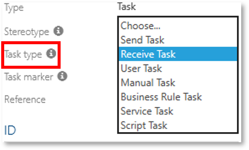
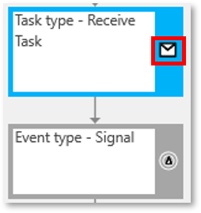

# BPMN Icons shown on Process flow objects (Released feature) 

With this feature, specific icons of the BPMN2.0 methodology are depicted graphically on process flow objects (currently tasks and events) upon the definition of triggers, markers and types in Detail Content by the Author.

            
