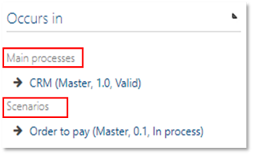

# Method: Changed evaluation groups for processes (Experimental feature)

By activating this feature, the section ‘Occurs in’ appears in the Detail Content of the PROCESSES facet, Here, processes or scenarios are listed in which the currently selected process occurs, thus usually as a process reference or an interface. The listed items are clustered by type, i.e. Main processes, Sub processes or Scenarios. 

   

