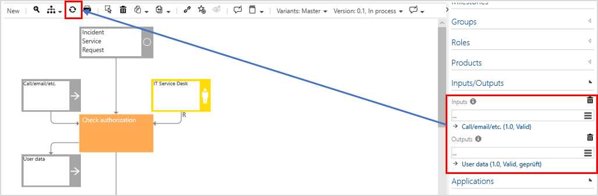

# Enhancement of detailed modeling

Please note: This feature will be automatically enabled in all future versions and cannot be disabled. 

This feature aims that an update of a process graphic will only be triggered once the User clicks the refresh button in the Toolbar.

Performance is improved considerably because the process graphic is no longer updated automatically when objects are added or changed.

Modelling or deleting processes or objects, however, are still updated automatically, since these changes have consequences for the structure of the process. The changes between two updates are automatically cached as before. 