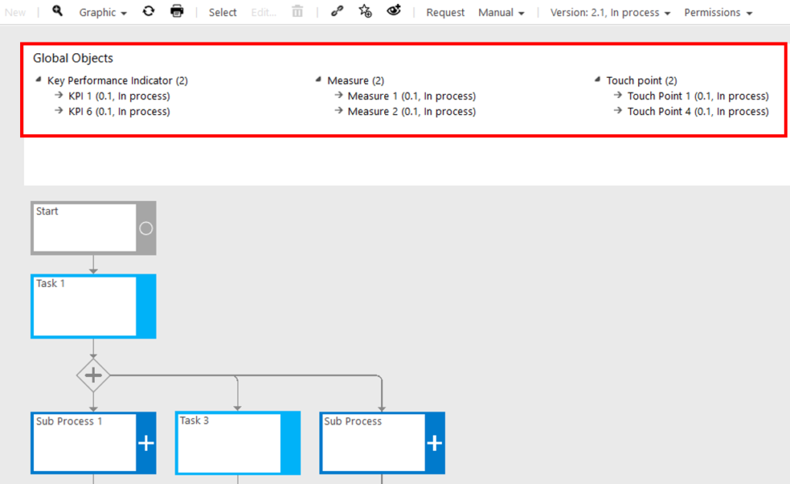

# Fact sheet: related global objects

By this feature, a specific process view can be selected in the ‘Graphic’ dropdown of the Toolbar. It shows connected global objects within the currently opened Main or Sub Process - directly above the process flow. 

The graphical layout is defined by the Admin, similar to a fact sheet.

Please refer to [Fact sheet - global objects](https://docs.symbioworld.com/admin/administration/fact-sheets/factsheet-global-objects) for more details.  