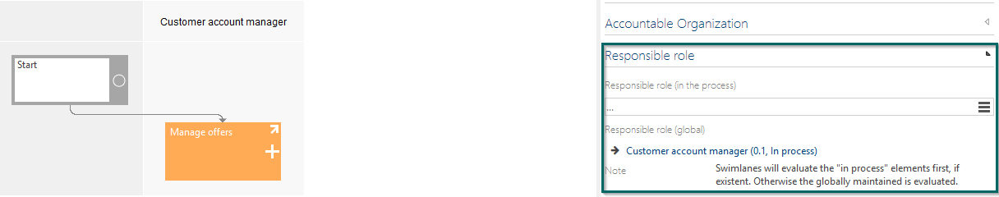

# Method: Global responsible role for sub processes

Activating this feature enables the author of a sub process to define a global responsible role. This assigned role is shown automatically in the swimlane view, when the sub process is referenced as interface in other sub processes. 
An author who uses the reference to the sub process additionally could add another role who is responsible of the sub process interface in the current process. 

The global responsible role is also changeable on a released sub process via the "Edit attributes" dialog. 