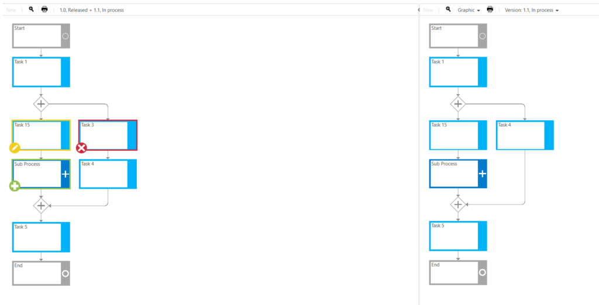

# Graphical version comparison (Released feature) 

This feature enables all users to see directly the deviations of different process versions. Content or attributes that have been added, removed or changed in a new process version are highlighted in different colours. 

