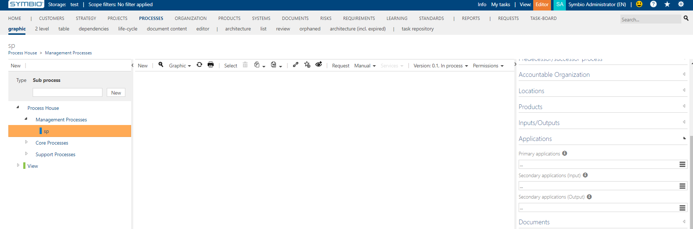
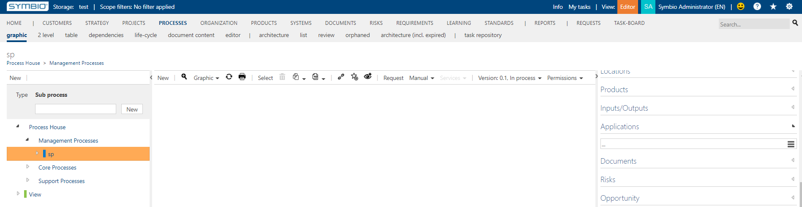

# Method: hide secondary application connections as inputs and outputs feature

With this feature activated secondary application connection will be hidden. 

Example for secondary applications:

When feature is not activated 

When feature is activated
