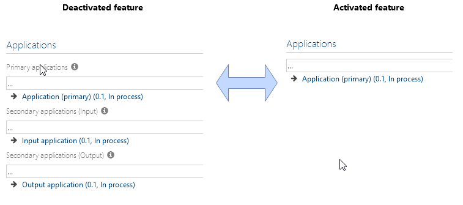

# Method: hide secondary application connections as inputs and outputs feature

This feature enables a simplification of the used method in relation to the assignment of applications to processes or tasks. 

If the feature is activated, only the simplified assignment is displayed for main and sub processes as well as for tasks, repository tasks and best practice tasks. 

**Please be aware:**

On activating the feature, no data conversion is done automatically. If there are already existing data for Secondary applications (input) or Secondary applications (output) in the database, they are not converted automatically to the primary assignment. They remain in the database, but are no longer displayed. 
When the feature is deactivated again, the data will be displayed as before. 

If you decide to activate the feature, it should be ensured that any existing relationships are automatically or manually migrated to the primary relationship beforehand. 
