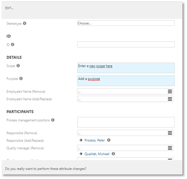

# Massdata editing

Before acitivating this feature, please make sure that the feature __Multisselection in lists__ is activated. After activation an __Edit__ button appears in the __list__ view, e.g. of the PROCESSES facet.

Currently, only the Administrator authorized to edit mass data. To start the mass data editing, just select all elements to be edited, click the __Edit__ button to open the dialog window.

 

The Admin is now allowed to edit a large number of linked objects quickly, e.g. of roles, responsible persons or scope filters. Existing elements can be removed or changed as well as new elements can be added.

Please note that only elements with state "in progress" can be edited. In case that objects are selected by mistake although they are not connected they are treated as to be removed.  

  

