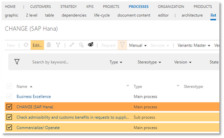

# Mass data editing 

__Prerequisite__ for the activation of this feature is the prior activation of the __multiselect in lists__ feature.

This feature enables Admins to edit a large number of linked objects quickly, e.g. mass changes of connected roles, responsible persons or definition of scope filters. Existing elements can be removed or changed as well as new elements can be added.

It is recommended to first increase the list page size to 200 under Settings to have full overview:

   

 To edit mass data, navigate to the list view of the respective facet, e.g. PROCESS list. Then all processes or objects whose linked elements are to be edited are selected. The respective status is irrelevant.

Clicking on the (now active) Edit button in the toolbar opens a dialog window for further input.

When all mass data have been processed, a clear change notice appears after clicking OK, in which new / data to be replaced is shown in green and data to be removed is shown in red. Unchanged elements are also listed. The mass data is only actually changed after you have confirmed it again (OK).

__NOTE:__ 

•	Changes can only be made by Admins

•	You can only edit processes that have the status "in progress", i.e. no changes are made to released processes

•	If the wrong object is accidentally selected which is not linked to the process, it is treated as an element to be removed

 
