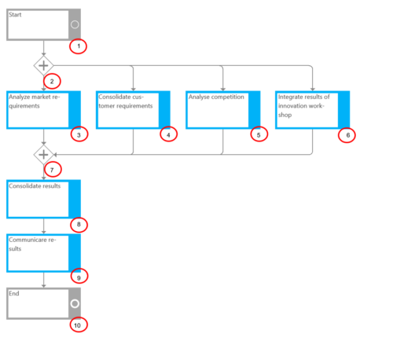
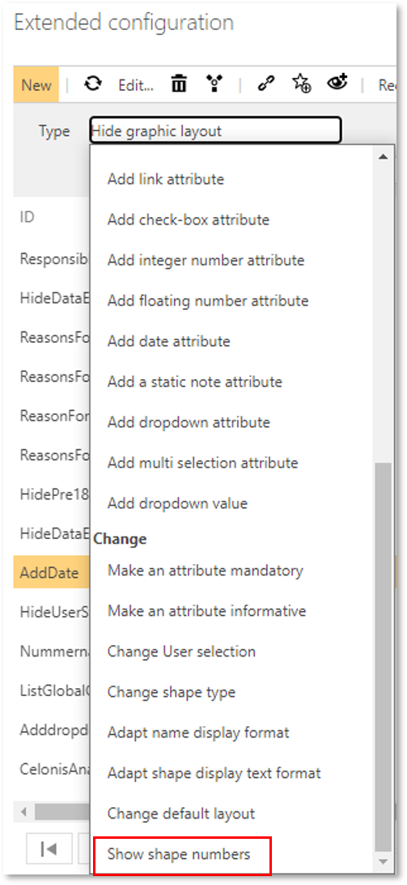

# Method: Numeration of process flow objects 

By activating this feature, numberings on the process flow objects are displayed. This is available for for all graphic layouts (horizontal/vertical etc.) 

The numbers are displayed on the objects at the bottom right is provided, showing the process steps sorted by applications in vertical or horizontal swimlanes. 

__NOTE:__ To use this feature it is required to make settings in the Extended Configuration: Please add a new type __Show shape numbers__ in the 'Change' section and, in the Detail Content, select the layouts for which it should be applied.

Please refer to [Storage configuration](https://docs.symbioworld.com/admin/administration/storage-configuration/storage-configuration/) for more details.