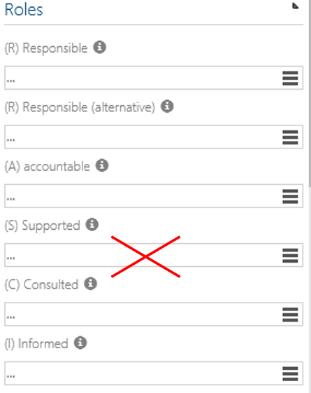

# RACI instead of RASCI

This feature allows to shorten the RACIS method to the RACI method if the "supported" (S) Role or Group are not to be maintained. It will then disappear in the Detail Content after activation.

