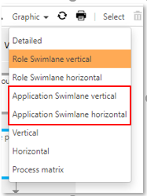
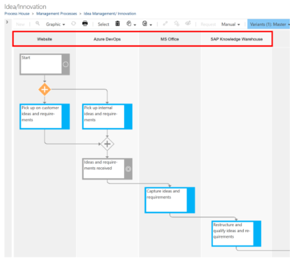

# Diagram mode: Application Swimlane (Preview feature)

By activating this feature, a __new Graphic view__ is provided, showing the process steps sorted by applications in vertical or horizontal swimlanes. 

For each application added to a task, a specific swimlane is created - otherwise swimlanes are generated by default for the specifically selected roles.

   
 
