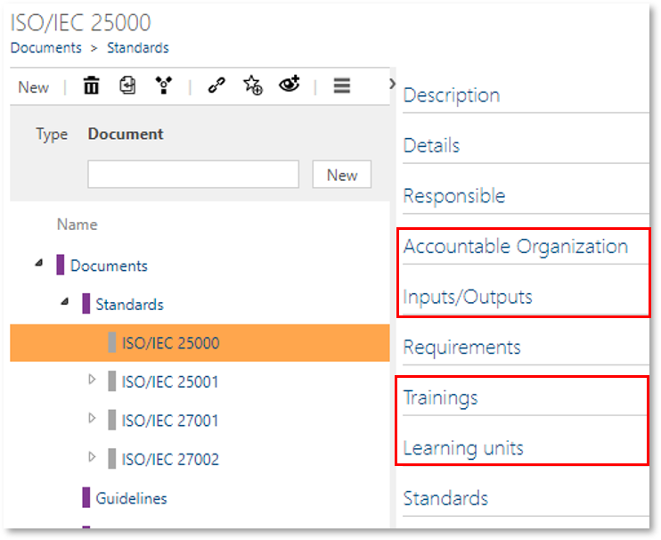

# Method: Additional relationships for documents

With this feature, you can provide additional information for documents, e.g. if the creation of a document is related to a specific input/output or training.

After activation, the following objects appear in the Detail Contents of the DOCUMENTS facet to be related accordingly:

- Accountable Organization
- Input/Outputs
- Training
- Learning units 

