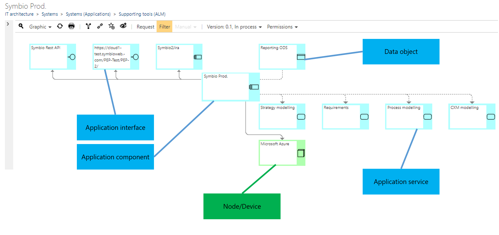

# Method: System ArchiMate Converting (Preview feature)

This feature allows to depict the IT landscape by the ArchiMate 3.0 nomenclature and thus takes an important step towards the design and control of a comprehensive Enterprise Architecture (EAM).

This is implemented in practice by a converter transforming the conventional Symbio system/system component objects and stereotypes to ArchiMate 3.0 types. Objects assigned to processes remain unchanged.

Please contact us for comprehensive EAM consulting.