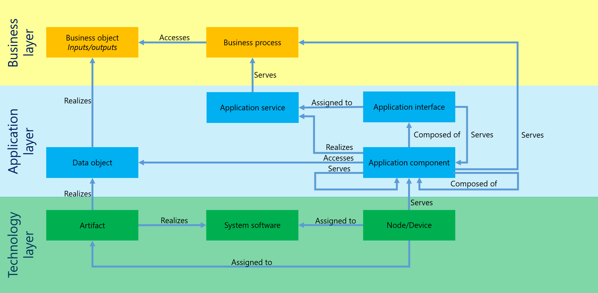

# ArchiMate Conversions

The ArchiMate 3.0 methodology offers a standard modeling language to design the construction and operation of business processes, organizational structures, information flows, IT systems and technical infrastructure.   

This feature allows to depict the IT landscape by the ArchiMate 3.0 nomenclature and thus takes an important step towards the design and control of a comprehensive Enterprise Architecture (EAM).

This is implemented in practice by a converter transforming the conventional Symbio system/system component objects and stereotypes to ArchiMate 3.0 types. Objects assigned to processes remain unchanged.

