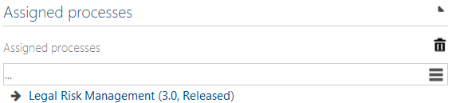

# Global assignment of processes to a document

Activating this feature enables the author of a document, to assign main and/or sub processes to show an additional connection between a document and a process. It is not necessary to be responsible/author of the assigned process. It is not possible to connect new processes but only existing. 

This connection is also visible on the process side, but it is not changeable. 

The names of the groups are renameable in the extended configuration. 