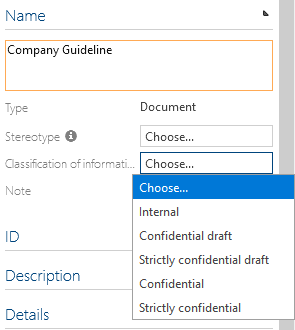

# Classification of information

This feature affects the DOCUMENTS facet. After activation a new section "Classification of Information" appears in the Detail Content of a document.

There are there are 3 different values to choose from the dropdown. If none of these values is selected, the corresponding document is considered "public".

