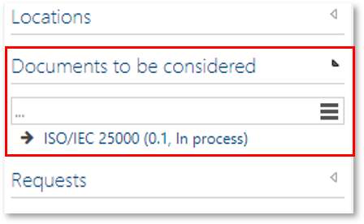

# Method: "Documents to be considered" for organizational units

This feature allows to add the section "Documents to be considered" in the Detail Content of organizationals units (below ORGANIZATION). 

It may be helpful to store documents valid for a certain organizational unit here, e.g. procedural instructions or ISO specifications.

