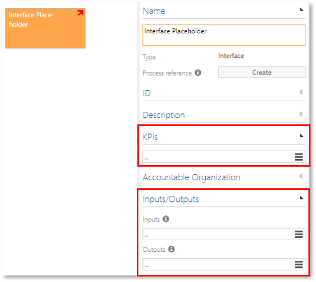

# Method: KPI and Inputs/Outputs to Interface Placeholders

This feature allows to add the sections "KPIs" and "Inputs/Outputs" to an interface placeholder of the PROCESSES navigation.  

During a modeling process, interfaces are often inserted as placeholders, if the referenced process does not yet exist. At this point it may be useful to further specify the placeholder by inputs and outputs as well as key performance indicators.

