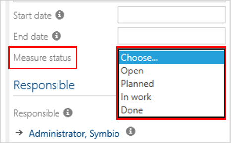

# Method: Maintain 'Measures' status (Preview feature)

This feature allows to add the section "Measure status" in the Detail Content of Sub Navigation "measures" (below STRATEGY). 

The suitable status value can be selected from dropdown and is also available in the filter bar.

