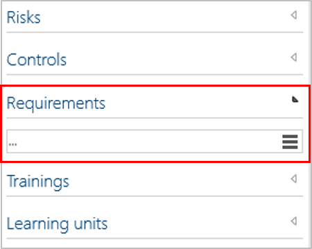

# Method: 'Requirements' for main processes (Preview feature)

This feature allows to add the section "Requirements" in the Detail Content of Main Processes. 

As usual, existing Requirements can be selected (via hamburger button or autocomplete), otherwise they can be created new.

