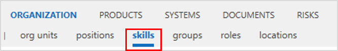

# Skill feature

By this feature, the new Sub navigation __skills__ is added below ORGANIZATION. 

Required skills of different stereotypes (education, languages etc.) can be created and then linked to positions, groups and roles.

