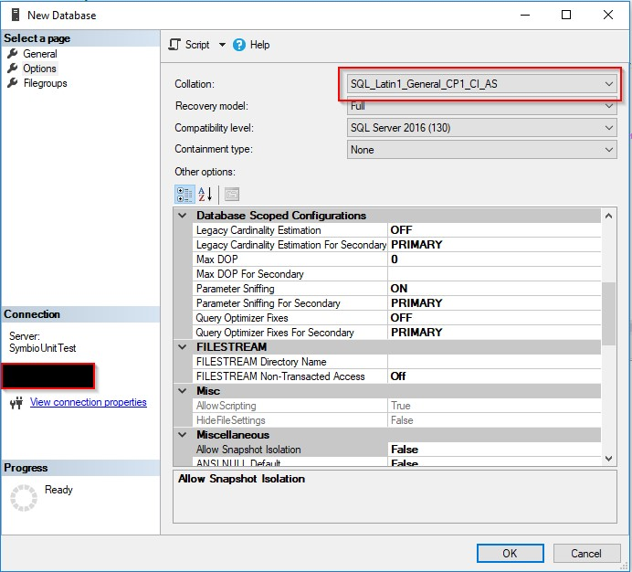
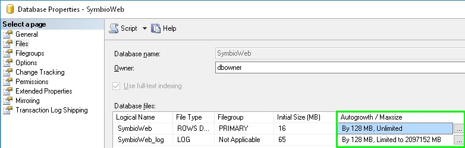

# Additional informations

## Installation of Internet Information Server

For this we refer to the [Microsoft documentation:](https://technet.microsoft.com/en-us/library/hh831475.aspx#InstallIIS)

## Note for MS SQL Server with Case Sensitive setting

If you have installed an MS SQL Server with a default sort that is not Case Insensitive, you must set the collection to „SQL\_Latin1\_General\_CP1\_CI\_AS&quot; when you create the database:

 

## Note for Active Directory link via SAML 2.0

An Identity Provider is required to use Active Directory link via SAML 2.0.
For example, a possible Identity Provider could be [AD FS](https://technet.microsoft.com/en-us/windowsserver/dd448613.aspx) (Active Directory Federation Services)

## Note for MS SQL Server database file settings

To avoid performance bottlenecks on SQL Server side, the AutoGrowth settings of the database should be set to higher values. This improves especially import tasks.
Since Symbio Web 5.6 this value can be also set in the Web.config.

 

## Note for MS SQL Server database maintenance

The performance of database queries in Symbio can be improved on SQL Server side by rebuilding the indices of each table in a database frequently, e.g. nightly after creation of the database backup. Until Symbio 5.9 it&#39;s also recommended to rebuild these indices after larger import tasks (500 MB) once a backup was created before.