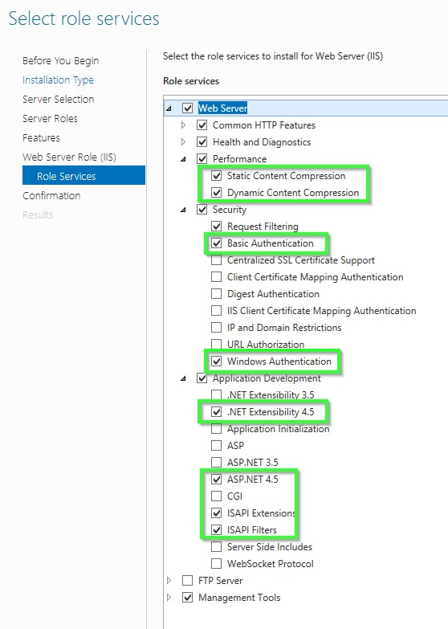
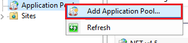
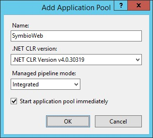
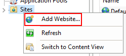
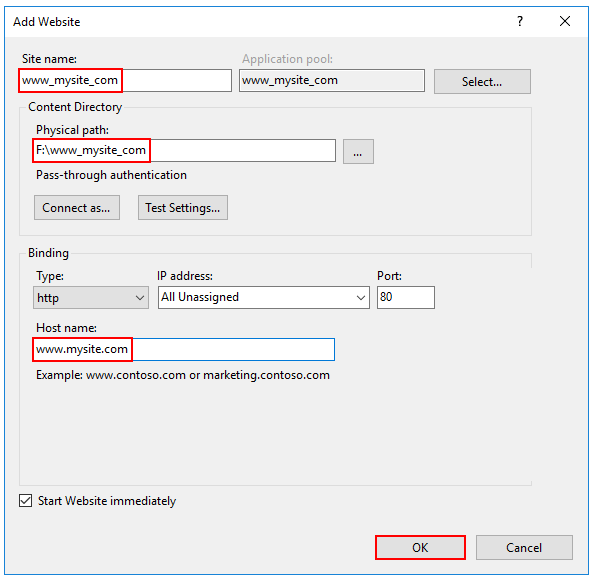
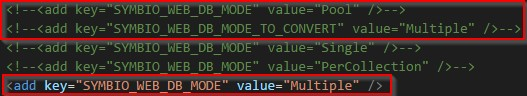
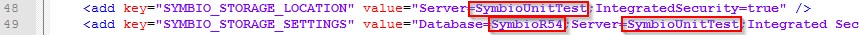
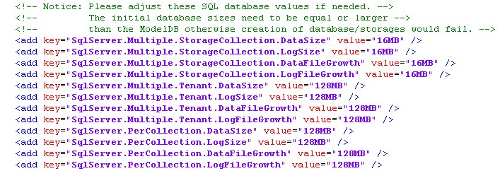
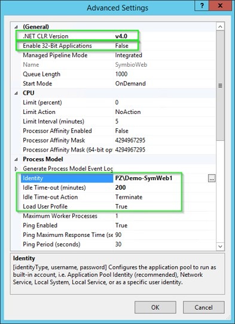
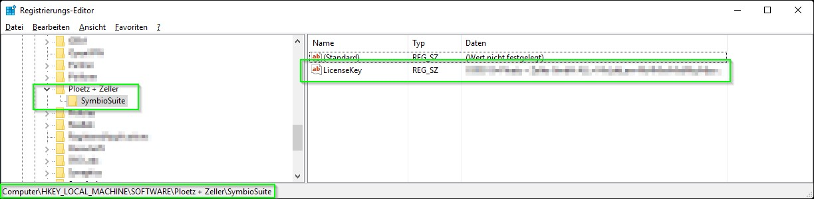

# Installation Manual

The manual installation describes each installation step in detail. Please use this instruction if the script installation had no successful result or if you cannot run PowerShell scripts.

## IIS Installation

Enable the Web Server (IIS) role and establish role services.

- Windows Server

### Windows desktop operating systems

Navigate to **Control Panel** > **Programs** > **Programs and Features** > **Turn Windows features on or off** (left side of the screen). Open the group for **Internet Information Services** and **Web Management Tools**. Check the box for **IIS Management Console**. Check the box for **World Wide Web Services**. Accept the default features for **World Wide Web Services** or customize the IIS features to suit your needs.


### Windows Server operating systems

For server operating systems, use the **Add Roles and Features** wizard via the **Manage** menu or the link in **Server Manager**. On the **Server Roles** step, check the box for **Web Server (IIS)**.


On the **Role services** step, select the IIS role services you desire or accept the default role services provided.



Proceed through the **Confirmation** step to install the web server role and services. A server/IIS restart is not required after installing the Web Server (IIS) role.

---

### Create the IIS Website

1. Start the Internet Information Server (IIS)

#### This is how you start IIS-Manager in the dialogue field &quot;Execute&quot;

1. On the **Start** menu, click **All Programs** , click **Accessories** , and then click **Run**.
2. In the **Open** box, type **inetmgr** and then click **OK**

#### This is how you start IIS-Manager from the Administrative Services console

1. On the **Start** menu, click **All Programs** , click **Accessories** , and then click **Run**.
2. In the **Run** text box, type **control panel** , and then click **OK**.
3. In the **Control Panel** window, click **Classic View** , and then double-click **Administrative Tools**.
4. In the **Administrative Tools** window, double-click **Internet Information Services**.

#### This is how you create an application pool on a web server

1. In the **Connections** pane please expand the server name and click on  **application pools**.
2. On the page  **Application pools**  please click on **Add application pool** in the **Actions**
3. In the dialogue field **Add application pool** please enter a unique name for the application pool in the field **Name**. Or right click on the area and select the option 'Add Application Pool...'

    

    A new dialog opens. Maintain the following values.
    1. In the List  **.NET Framework-Version**  please select the following .NET Framework version: NET CLR Version v4.0.x
    2. From the list **Managed pipeline mode** please select the **Integrated** , if you want to use the pipeline integrated in IIS und ASP.NET. Select **No Managed Code** if you install an Microservice for Symbio. ASP.NET Core runs in a separate process and manages the runtime.

4. Please select  **Start application pool immediately** to start the application pool whenever the www service is started. This option is activated by default.
5. Click on  **OK**.

     

#### This is how you add a website

1. In the **Connections**  pane please right-click the node **Sites**  in the tree and then click on **Add**** Web Site**. Or right click on the area and select the option 'Add Website'.

   

2. In the dialogue field  **Add**** Web Site** please enter a name for the website in the **Website name** box.
3. Click on  In the dialogue field  **Select application pool** please select the application pool which you have created in the previous section and then click on  **OK**.
4. In the field  **Physical path**  please type the physical path of the Web site&#39;s folder, or click the browse button ( **...** ) to navigate the file system to find the folder.
5. If the physical path that you entered is to a remote share, click **Connect as** to specify credentials that have permission to access the path. If you do not use specific credentials, select the **Application user (pass-through authentication)** option in the **Connect As** dialog box.
6. Select the protocol for the Web site from the **Type** list.
7. The default value in the **IP address** box is **All Unassigned**. If you must specify a static IP address for the Web site, type the IP address in the **IP address** box.
8. Type a port number in the **Port** text box.
9. Optionally, type a host header name for the Web site in the **Host Header** box.
10. If you do not have to make any changes to the site, and you want the Web site to be immediately available, select the **Start Web site immediately** check box.
11. Click  **OK**.

   

#### Recommendation

Create for each environment (Test and Prod) a website.

## Basic settings

Please unpack the Symbio Web installation package on the applications server.

**Recommendation:**
It is recommended to provide two parallel installations:

- C:\Symbio\SymbioWebTest
- C:\Symbio\SymbioWebProd

**Note:**
The database is created automatically at the start of the application.

## Settings in the configuration file (Web.config)

### Database mode: Pool, Single or Multi

**Notice:**
In addition to the database modes known so far, the pool mode has been added for version 1808. This mode will be activated by default. Please comment on the following lines shown on the Screenshot from the Web.config to deactivate this feature. For further Information about the databasemode pool please check the admin and operations manual.



- With the setting **\&lt;add key=&quot;SYMBIO\_WEB\_DB\_MODE&quot; value=&quot;Multiple&quot; /\&gt;** an SQl database is created for each collection or storage created in Symbio.

- With the setting **\&lt;add key=&quot;SYMBIO\_WEB\_DB\_MODE&quot; value=&quot;Single&quot; /\&gt;** only one SQL database is created which contains all data.

- With the setting **\&lt;add key=&quot;SYMBIO\_WEB\_DB\_MODE&quot; value=&quot;Pool&quot; /\&gt;** For each pool, an SQL database is created that contains all the storages created and assigned in it, including data.

The standard setting is: „**Pool**&quot;

**Configure database server:**

- With the setting **SYMBIO\_STORAGE\_LOCATION** and **SYMBIO\_STORAGE\_SETTINGS** you can configure the SQL Server and the SQL database which is to be used.

  

|     |     |
| --- | --- |
| **Server** | srv-db\COMMON |
| **Database** | SymbioWebDB |

**Note:**
For each installation (Test / Prod) a unique database name must be selected.

### Configure initial database sizes (since Symbio Web 5.6)

If the Symbio database is configured for Multi-DB mode, then several settings can be configured to set the initial database file size (MDF) and the initial log file size (LDF):

- SqlServer.Multiple.Tenant.DataSize
- SqlServer.Multiple.Tenant.LogSize

The AutoGrowth values for database and log files can be set in:

- SqlServer.Multiple.Tenant.DataFileGrowth
- SqlServer.Multiple.Tenant.LogFileGrowth

**Notice:**
These values which can be configured here need to be equal or larger than the ModelDB settings otherwise databases cannot be created. 

### Setting for update interval of rendering diagrams (since Symbio 5.6)

Since Symbio Web 5.6 diagrams are stored into the database so that opening of diagrams in Viewer mode is much faster. If the diagram is updated, e.g. because the executing role of an interface has been changed, then this change is only visible after a maximum of 30 seconds. This value can be configured in **Symbio.BackgroundRenderingUpdateInterval** and is currently set to 30 seconds.


If this setting does not exist, an internal value of 60 seconds will be used.

### Settings for Free&amp;Easy environments (since Symbio 5.8)

With Symbio Web 5.8 a Free&amp;Easy mode has been introduced which can restrict certain aspects of the release workflow. Besides a customized configuration the setting &#39;Symbio. RestrictReleaseWorkflowDatabaseNameRegex&#39; has to be activated. The value contains the regular expression that is used to match the current storage name and determine whether to activate the Free&amp;Easy mode.

```` xml
<add key="Symbio.RestrictReleaseWorkflowDatabaseNameRegex" value="^sandbox-" />;
````

### Settings for server error pages (since Symbio 5.8)

Since Symbio Web 5.8, in case of Web server errors only a single generic error page is displayed to hide private (server) data to users. For debugging purposes detailed error pages can be activated in the Web.config:

```` xml
<customErrorsmode="Off" defaultRedirect="~/Errors/error.html"/>
````

### Settings for encrypted communication via HTTPS (since Symbio 5.8)

Since Symbio Web 5.8, it&#39;s configurable in the Web.config whether all web server communications should be transmitted encrypted.

To enable HTTPS, an SSL certificate is required and this setting needs to be activated:

```` xml
<!-- <httpCookies requireSSL="true" />-->
````

### Settings for Symbio Web security (since Symbio 5.9)

Since Symbio Web 5.9, the following 5.8 security settings have been enabled:

```` xml
<httpProtocol>
 <customHeaders>
    <clear />
    <addname="Strict-Transport-Security" value="max-age=16070400; includeSubDomains" />
    <addname="X-XSS-Protection" value="1; mode=block" />
    <addname="X-Content-Type-Options" value="nosniff" />
    <addname="X-Frame-Options" value="SAMEORIGIN" />
  </customHeaders>;
</httpProtocol>;
````

**Note:**
If images are not displayed in browser (e.g. IE 11) or external sites cannot be accessed by Symbio plug-ins, these security settings should be disabled for testing purposes. Please note that after modifying the Web.config the application pool restarts. Please validate settings in your test environment first.

Now you can install the additional Microservices

## Installation Rendering Service (optional service)

The installation of the Rendering service can be found [here](../../services/rendering-service/installation-scripted.md)

## Installation UniqueID Service (optional service)

The installation of the UniqueID service can be found [here](../../services/unique-id-provider/install-intro.md)

## Installation Reporting Service (optional service)

The installation of the Reporting service can be found [here](../../services/reporting-service/overview.md)

---

After you have created the IIS as [described here](./IIS-Installation.md) as well as the Symbio Application Pool and related website

1. Open the advanced settings for the application pool
2. Open the dialogue in the attribute **Identity**
3. Please select **Custom account** and click on **Set**
4. Enter a **user** with the following authorization:

The user must be authorized for the DB Server and the DB

- The user must be part of the local group **IIS\_IUSRS**
- The user must be authorized for the application directory

 

**Note:**

The configured user must have a user profile on the server. If such a profile does not exist, it can be created as follows:

```` cmd
RUNAS /env /user:**** [server] ****\SymbioWeb notepad.exe
````

## Server settings

### Authorization in the application directory.

The configured user must have the following authorization:

  1. The user must have ( **Read &amp; Execute** , **List folder contents** , **Read** ) rights in the application directory
  2. The user must have ( **Write** , **Modify** ) rights in the sub directory "**log**"

### Enter the license key for Symbio Web

Please enter the license key you have received in the registry.

Path: **[HKEY\_LOCAL\_MACHINE\SOFTWARE\Ploetz + Zeller\SymbioSuite]**

Create a new string by the name: ``LicenseKey``

As value please enter the license key.

 

 Continue with the installation of the required and optional Symbio services [Preparation](./Requirements.html). For first steps see [First Steps](./Finishing.html).
