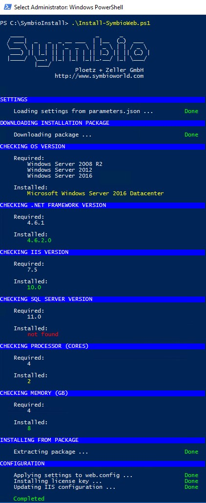

# Scripted Installation

Symbio can be initially installed by using a PowerShell script.

## Preparation

- Please download the installation script (Install.ps1) and the configuration file (parameters.json) on the following internet site: http://operations.symbioworld.com/

- Please check if you have access to the Symbio download file or download the installation data before.

- Copy the installation script and parameter file into a local directory. For example ``C:\SymbioInstall``

- Open PowerShell as Admin Please open the PowerShell environment (64 Bit) with administrator rights. Please go into the script directory: (C:\SymbioInstall)

**Note:**
Please make sure that PowerShell can run scripts.

## Adjust Parameter.json

Please open the **Parameter.json** with a text editor and adjust the contained parameters.

| **Parameter** | **Example** | **Description** |
| --- | --- | --- |
| **Symbio - allgemein** |   |   |
| SourcePath | https://www.symbioworld.com/download/symbio/symbio-master.zip | The path to the installation files. Can be an URL to the installation package, a path to the local installation package or a path to a local folder containing the already extracted installation package. |
| BaseTargetPath | C:\\SymbioWeb\\Test | Target directory for the Symbio application. Please note the double backslashes. |
| BaseBackupPath | C:\\Backups | Compressed backups of an instance are stored in this directory. |
| InstanceName | SymbioTest | The name of the Symbio instance. This name is used as a subfolder in the backup and destination path. |
| CertificatesPath | C:\\Certificates | The path to the SAML certificates. These are copied into the App\_Data directory. |
| LicenseKey | 12345678 | The license key for Symbio will be provided by our team.This license key will be added to the registry. Please also refer to server settings/license key chapter. |
| **Symbio - Web.config** |   |   |
| SYMBIO\_STORAGE\_LOCATION | Server=MSSQLSERVER;IntegratedSecurity=true | This parameter is only required **until** Symbio 1807:MS SQL Server instance nameif you do not know the server name, please use the following SQL query: SELECT @@SERVERNAME |
| SYMBIO\_STORAGE\_SETTINGS | Database=Database;Server=MSSQLSERVER;Integrated Security=true;common.cachingenabled=true;common.objectcachingenabled=true;common.tenant=Default;MultipleActiveResultSets=True;App=Symbio | This is the connection string of the MS SQL Server.Please adjust database name and SQL server accordingly.if you do not know the server name, please use the following SQL query: SELECT @@SERVERNAME |
| Symbio.RestrictRelease WorkflowDatabase NameRegex | ^sandbox- | In databases beginning with &quot;sandbox-&quot; no release cycle is available, so called FreeDBs. This setting is disabled in the Web.config as per default. |
| PngRenderingServiceEndpunktUrl | https://localhost:1234/png | This parameter is required **since** Symbio 1807:The endpoint for the rendering service. Enter the URL configured in the rendering service here. |
| **Symbio – IIS settings** |   |   |
| Enabled | true | If set to „false&quot;, an existing WebSite is used. |
| SiteName | SymbioTest | Name of the WebSite in IIS. Can be left blank if InstanceName is equal to SiteName |
| ManagedRuntimeVersion | v4.0 | .NET Framework version which the application pool will use |
| IdentityType | 3 | The application pool needs to run unter specific user account. |
| ApplicationName |   | Optional setting. |
| ApplicationPoolName | SymbioTest | Name of application pool. Should be identical named like the Symbio WebSite. |
| ApplicationPoolUser | User | User account which the application popl uses. Please use duplicate backslashes if domain is required., e.g. domain\\user. |
| ApplicationPoolPassword | Password | Password of the user account. **Attention**  This password is stored in cleartext in the Parameter.json file. You can also set the password directly in the application pool. Or just remove the password setting in the json file once the Symbio site is successsfully running. |
| **Bindings** |   | Symbio needs specific bindings where the Symbio site is to be opened in browser. |
| http | &quot;Protocol&quot;: &quot; **http**&quot;,        &quot;IPAddress&quot;: &quot;\*&quot;,        &quot;Port&quot;: 2111,        &quot;HostName&quot;: &quot;SymbioTest&quot; | The default http port is 80. The host name can be &quot;localhost&quot; or a registered host name, such as example.symbioweb.com. HostName can be left blank, whoever comes with InstanceName |
| https | &quot;Protocol&quot;: &quot; **https**&quot;,        &quot;IPAddress&quot;: &quot;\*&quot;,        &quot;Port&quot;: 2112,        &quot;HostName&quot;: &quot;SymbioTest&quot;,        &quot;CertificateHash&quot;: &quot;c1b10a2635ab6cda3dc536863486a7ea0af1cb17&quot; | The default https port is 443. The host name can be &quot;localhost&quot; or a registered host name, such as example.symbioweb.com. You can find the hash value for the SSL certificate in the IIS under Server Certificates. If the certificate was not found, it is possible that the first character is &quot;corrupt&quot;. Please replace the first &quot;corrupt&quot; character manually in Notepad. HostName can be left blank, whoever comes with InstanceName. |

**Note:**
Please make sure the Symbio installation directory exists on your local system:
e. g. "C:\Symbio\SymbioTest"

## Start the installation

You can call up a detailed description of the parameters as follows:

```` Powershell
get-help .\Install.ps1
````

If you do not change any parameters you can run the script using the following command:

```` Powershell
.\Install.ps1
````

The expected result should look like this

 

## Verify Symbio website settings in IIS

1. Start Internet Information Services (IIS) Manager
2. Verify bindings of configured Symbio website
3. Verify and test basic settings of configured Symbio website
4. If Symbio website is not running, please start it (Manage Website/Start)

Continue with the installation of the required and optional Symbio services [Preparation](Requirements.md). For first steps see [First Steps](Finishing.md).

