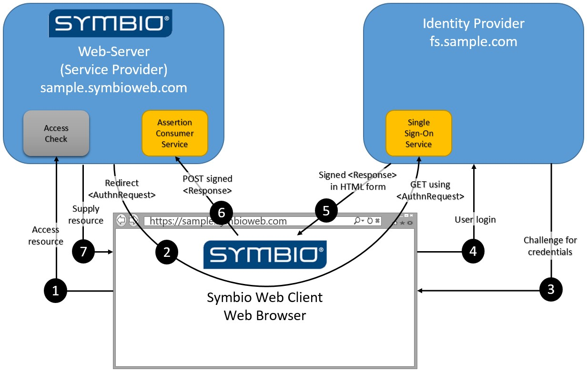
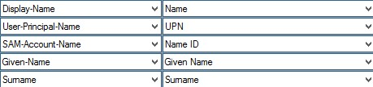
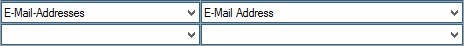
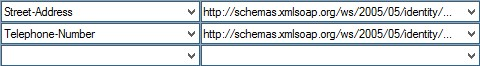

# SAML: Requirements for the Identity Provider

## Active Directory (AD) link via SAML 2.0

The following chapter explains the synchronization of Active Directory users and groups. Synchronized users are not shown a login dialogue.

In Symbio Web Active Directory user can be linked via SAML 2.0 so they can log onto Symbio Web with their Windows user accounts without having to set up users manually in the Symbio Web user settings.

For the configuration settings in Symbio Web als well as in the [Active Directory Federation Services](https://technet.microsoft.com/en-us/windowsserver/dd448613.aspx) on your Ative Directory-Server have to be adjusted.

The identity provider makes it possible for Symbio users to log in with authentication information provided by the identity provide:

- Symbio is the Service Provider here.
- Identity Provider can be Active Directory Federation Services, for example.
- Symbio authenticates against the identity provider via the browser, so identity provider and Symbio Web cannot access each other.

Communication takes place via the browser, which has access to both networks.

The following picture shows the authentication process:

 

## Claims

The following information is needed:

| **Title** | **Definition of content** | **Necessary** | **Claim Type** |
| --- | --- | --- | --- |
| Name | Name of user | Yes | [http://schemas.xmlsoap.org/ws/2005/05/identity/claims/name](http://schemas.xmlsoap.org/ws/2005/05/identity/claims/name) |
| UPN | Attributes of clear content | Yes | [http://schemas.xmlsoap.org/ws/2005/05/identity/claims/upn](http://schemas.xmlsoap.org/ws/2005/05/identity/claims/upn) |
| Last Name | Last name of user | Yes | [http://schemas.xmlsoap.org/ws/2005/05/identity/claims/surname](http://schemas.xmlsoap.org/ws/2005/05/identity/claims/surname) |
| First Name | First name of user | Yes | [http://schemas.xmlsoap.org/ws/2005/05/identity/claims/givenname](http://schemas.xmlsoap.org/ws/2005/05/identity/claims/givenname) |
| E-Mail | E-Mail address of user | Yes | [http://schemas.xmlsoap.org/ws/2005/05/identity/claims/emailaddress](http://schemas.xmlsoap.org/ws/2005/05/identity/claims/emailaddress) |
| Group | Group claims (One Claim with type per group, only necessary for assigning administrators) | Optional | [http://schemas.xmlsoap.org/ws/2005/05/identity/claims/group](http://schemas.xmlsoap.org/ws/2005/05/identity/claims/group) |
| Office Address | Office address of user | No | [http://schemas.xmlsoap.org/ws/2005/05/identity/claims/streetaddress](http://schemas.xmlsoap.org/ws/2005/05/identity/claims/streetaddress) |
| Office ZIP | Office ZIP of user | No | [http://schemas.xmlsoap.org/ws/2005/05/identity/claims/postalcode](http://schemas.xmlsoap.org/ws/2005/05/identity/claims/postalcode) |
| Office Country | Office country of user | No | [http://schemas.xmlsoap.org/ws/2005/05/identity/claims/country](http://schemas.xmlsoap.org/ws/2005/05/identity/claims/country) |
| Private Telephone number | Private telephone number of user | No | [http://schemas.xmlsoap.org/ws/2005/05/identity/claims/homephone](http://schemas.xmlsoap.org/ws/2005/05/identity/claims/homephone) |
| Business Telephone number | Business telephone number of user | No | [http://schemas.xmlsoap.org/ws/2005/05/identity/claims/otherphone](http://schemas.xmlsoap.org/ws/2005/05/identity/claims/otherphone) |
| Date of birth | Date of birth of user | No | [http://schemas.xmlsoap.org/ws/2005/05/identity/claims/dateofbirth](http://schemas.xmlsoap.org/ws/2005/05/identity/claims/dateofbirth) |

### With access to Symbio Web

If you already have access to Symbio Web you can download the meta data directly in Symbio Web.

If your storage address is [https://sample.symbioweb.com/storagecollection/storage](https://sample.symbioweb.com/storagecollection/storage) please call up the following URL

[https://sample.symbioweb.com/storagecollection/storage/Master/viewer/1031/Public/ServiceProviderFederationMetadata](https://sample.symbioweb.com/storagecollection/storage/Master/viewer/1031/Public/ServiceProviderFederationMetadata), in order to get the meta data for Symbio Web as Service Provider.

### Without access to Symbio Web

 In this case the XML file withe meta data for Symbio Web has to be generated as follows

```` xml
<md:EntityDescriptor xmlns:md="urn:oasis:names:tc:SAML:2.0:metadata" xmlns:saml="urn:oasis:names:tc:SAML:2.0:assertion" xmlns:ds="http://www.w3.org/2000/09/xmldsig#" entityID="http://symbioworld.com/web">

<!-- insert ds:Signature element -->

    <md:SPSSODescriptor AuthnRequestsSigned="false" WantAssertionsSigned="true" protocolSupportEnumeration="urn:oasis:names:tc:SAML:2.0:protocol">
        <md:KeyDescriptor use="signing">
            <ds:KeyInfo>
                <ds:X509Data>
                    <ds:X509Certificate>                   MIIFFTCCA/2gAwIBAgIMD4M0XYx9yvHdeWJkMA0GCSqGSIb3DQEBCwUAMFoxCzAJBgNVBAYTAkJFMRkwFwYDVQQKExBHbG9iYWxTaWduIG52LXNhMTAwLgYDVQQDEydHbG9iYWxTaWduIENvZGVTaWduaW5nIENBIC0gU0hBMjU2IC0gRzIwHhcNMTYwNjEwMTIwOTA2WhcNMTgwNzEzMTQxMDEzWjCBjzELMAkGA1UEBhMCREUxDzANBgNVBAgTBkJheWVybjERMA8GA1UEBxMIQXNjaGhlaW0xHTAbBgNVBAoTFFBsb2V0eiArIFplbGxlciBHbWJIMR0wGwYDVQQDExRQbG9ldHogKyBaZWxsZXIgR21iSDEeMBwGCSqGSIb3DQEJARYPaW5mb0BwLXVuZC16LmRlMIIBIjANBgkqhkiG9w0BAQEFAAOCAQ8AMIIBCgKCAQEAukQ+V/tNuElc0qWEaiMEedhTJmx7VsBs6/st74vnbhntK0XxW3oiBMoPDGZkcXHKCiVAIBfNNQvxeSTcZpzUcwf5r1lor8lXoAQTrJNArxe69nLKkjva2+3Ugfo0JgT+C9G197GuJFdqOYW58QMiO2i2TeenCVffotkNm1uPSLtISz3nYW3D1W1hGpTn/90u89vRedT/mVNfB3kvS6HBRFbakA1UvFdEjlnGbN/AhjgEx97v5LquictZy+xUpQ2OuOF6f5ZYuCFa3t4vEfOMOSTNEqNQYrvbJp9Uh5mDlv1L2uRRIRhy38XgN5824mSvVJMbzmLeA6MpQQ+YSC+hnwIDAQABo4IBozCCAZ8wDgYDVR0PAQH/BAQDAgeAMIGQBggrBgEFBQcBAQSBgzCBgDBEBggrBgEFBQcwAoY4aHR0cDovL3NlY3VyZS5nbG9iYWxzaWduLmNvbS9jYWNlcnQvZ3Njb2Rlc2lnbnNoYTJnMi5jcnQwOAYIKwYBBQUHMAGGLGh0dHA6Ly9vY3NwMi5nbG9iYWxzaWduLmNvbS9nc2NvZGVzaWduc2hhMmcyMFYGA1UdIARPME0wQQYJKwYBBAGgMgEyMDQwMgYIKwYBBQUHAgEWJmh0dHBzOi8vd3d3Lmdsb2JhbHNpZ24uY29tL3JlcG9zaXRvcnkvMAgGBmeBDAEEATAJBgNVHRMEAjAAMEIGA1UdHwQ7MDkwN6A1oDOGMWh0dHA6Ly9jcmwuZ2xvYmFsc2lnbi5jb20vZ3MvZ3Njb2Rlc2lnbnNoYTJnMi5jcmwwEwYDVR0lBAwwCgYIKwYBBQUHAwMwHQYDVR0OBBYEFKE6dalLVKEktsj83r4Dw359M0d3MB8GA1UdIwQYMBaAFBlKuFrkTTGlFOVe7C+jHPqAjDJrMA0GCSqGSIb3DQEBCwUAA4IBAQA7Tc3y8IcUafCa8kH6ZRe3lqAuwFKX4AH16JKgobktIS8VOZMol0F6mLEyIjOcOOuZik3eeJm9yhCNeBgWMujI5H0tXp7g4LfpY6PNUUs9naFL0HPeVtDb6ECRtj7PfhOIS9b3qsLFTf0Orx63Gl7zW4/H0NbaN4oyW0cydfuyfYVYk1l8SPuXFs+EJC2u9ilLNk8L7Z1yNE7xEVQvYb1UPvUGP5InNf28/xL0WWIuNO7Ez22FF6ABKtsM7V5eAhLpJM6TWk3NUpGshSmi/Ai4DHlJfHSxJl3xapTJ+w8VV5ZIWaqAQD5uapu1472FJy9HyvOPxzhPtGTZtp7NWHrM
                    </ds:X509Certificate>
                </ds:X509Data>
            </ds:KeyInfo>
        </md:KeyDescriptor>
        <md:AssertionConsumerService isDefault="true" index="0" Binding="urn:oasis:names:tc:SAML:2.0:bindings:HTTP-POST" Location="https://sample.symbioweb.com" />;
    <md:SPSSODescriptor>
    <md:Organization>
        <md:OrganizationName xml:lang="de">Ploetz + Zeller GmbH</md:OrganizationName>
        <md:OrganizationDisplayName xml:lang="de">Ploetz + Zeller GmbH</md:OrganizationDisplayName>
        <md:OrganizationURL xml:lang="de">http://www.p-und-z.de</md:OrganizationURL>
    </md:Organization>
    <md:ContactPerson contactType="other">
        <md:SurName>Ploetz + Zeller Administrator</md:SurName>
        <md:EmailAddress>mailto:administrator@p-und-z.de</md:EmailAddress>
    </md:ContactPerson>;
</md:EntityDescriptor>;
````

### AD FS: Active Directory Federation Services

You need to import the FederationMetadata.xml which you have downloaded or created yourself into your Active Directory Federation Services under trust relations to tell your AD FS to create a trust relation with us, [http://symbioworld.com/web](http://symbioworld.com/web) (Entity ID of Symbio World).

Furthermore, rules for group membership and groups have to be set so Active Directory user groups (e.g. SymbioCloudAdmins, SymbioAuthors, SymbioArchitects) are created automatically in Symbio Web and can be used there.

#### Exemplary rule for group memberships

c:[Type == &quot;[http://schemas.microsoft.com/ws/2008/06/identity/claims/windowsaccountname](http://schemas.microsoft.com/ws/2008/06/identity/claims/windowsaccountname)&quot;, Issuer == &quot;AD AUTHORITY&quot;] =< add(store = &quot;Active Directory&quot;, types = (&quot;[http://schemas.xmlsoap.org/claims/Group](http://schemas.xmlsoap.org/claims/Group)&quot;), query = &quot;;tokenGroups;{0}&quot;, param = c.Value);

#### Exemplary rule for groups

c:[Type == &quot;[http://schemas.xmlsoap.org/claims/Group](http://schemas.xmlsoap.org/claims/Group)&quot;, Value =~ &quot;(?i)symbio&quot;] =< issue(claim = c);

This means only AD groups containing „symbio&quot; as sub string are considered.

The sequence of the rules should look like this:

| Pos. | Rule | Type | Claims |
| --- | --- | --- | --- |
| 1 | Group Memberships | Custom Rule | c:[Type == &quot;[http://schemas.microsoft.com/ws/2008/06/identity/claims/windowsaccountname](http://schemas.microsoft.com/ws/2008/06/identity/claims/windowsaccountname)&quot;, Issuer == &quot;AD AUTHORITY&quot;] =\&gt; add(store = &quot;Active Directory&quot;, types = (&quot;[http://schemas.xmlsoap.org/claims/Group](http://schemas.xmlsoap.org/claims/Group)&quot;), query = &quot;;tokenGroups;{0}&quot;, param = c.Value); |
| 2 | Groups | Custom Rule | c:[Type == &quot;[http://schemas.xmlsoap.org/claims/Group](http://schemas.xmlsoap.org/claims/Group)&quot;, Value =~ &quot;(?i)symbio&quot;] =\&gt; issue(claim = c); |
| 3 | Basic Claim Rule | Send LDAP Attributes as Claims |   |
| 4 | Office Address | Send LDAP Attributes as Claims | |
