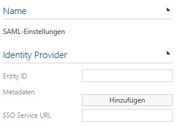
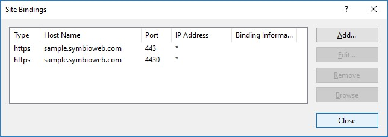
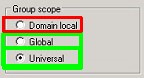

# SAML settings in Symbio Web

To install SAML authentication in Symbio Web please do as follows.

1. To configure an **Identity Provider** please navigate to the respective storage (system administration, storage collection or Storage), open the system settings and select the option &quot; **SAML settings**&quot;. An Identity Provider which is configured here is valid for all underlying storages – so in the case of the system administration it is valid for the complete application and in the case of the a storage collection it is valid for all storage contained in that collection. For the **Identity Provider** the settings have to be adjusted here.

    

    We need the following information from the **Identity Provider**

    1. **Metadata XML file** of the Identity Provider (from the AD FS): You can download it from your AD FS-Server with, for example, [https://fs.example.com/FederationMetadata/2007-06/FederationMetadata.xml](https://fs.example.com/FederationMetadata/2007-06/FederationMetadata.xml)

    2. **Entity ID** (also in the meta data), i.e. [http://fs.example.com/adfs/services/trust](http://fs.example.com/adfs/services/trust)

    3. **SSO Service URL** (also in the meta data), [https://fs.example.com/adfs/ls](https://fs.example.com/adfs/ls) Please note that the https log is entered here.

    Enter the Entity ID and SSO Service URL in the respective entry fields and upload the meta data XML.

    1)For authentication in Symbio Web via SAML it is recommended to use the HTTPS binding. For an administrative access for Ploetz + Zeller it is necessary to set up another HTTPS binding for Port 4430.
    The following bindings should be configured in the IIS:

    

2. Web.config – base configuration:
  **Only Symbio Web 5.2/5.3/5.4:** In the file Web.config, which can be found in the Symbio Web master folder, the following setting for SAML has to be activated because it is commented out by default:

    ````xml
    <add key="SymbioAuthenticationMode" value="SAML" />
    ````
    **Only Symbio Web 5.5-1807:** For an administrative access for Ploetz + Zeller via port 4430 the PZAdminLogin setting in the file Web.config, which can be found in the Symbio Web master folder, needs to be set from „false&quot; to „true&quot;:

    ````xml
    <add key="SAML.PZAdminLogin" value="true" />
    ````

3. Furthermore, it can be defined in the **Web.config** which user group from the Active Directory should have Administrator rights in Symbio Web (by default):

    ````xml
    <add key="Automation.AdminUsers" value="SymbioCloudAdmins" />
    ````

4. Now the administrative access via [https://sample.symbioweb.com/\_sysadmin/\_admin](https://sample.symbioweb.com/_sysadmin/_admin) should be possible. If not, please check: Adjust firewall settings and create rule for 80, 443, 4430. If, after the first login, the browser does not relay to Symbio Web automatically, please call up the page ([https://sample.symbioweb.com/\_sysadmin/\_admin](https://sample.symbioweb.com/_sysadmin/_admin)) again.

5. When the respective settings have been adjusted on the side of the **Identity Provider** , the website is available via the HTTPS-Standard-Binding of Symbio Web via this Identity Provider.

6. Login with a user who is a member of the administrator group **SymbioCloudAdmins** or alternatively with a user from the administrator group configured in step 4.

7. If you have already created other Symbio groups in your Active Directory those will be created and synchronized with the first login.

8. When an Active Directory user first logs onto Symbio Web he will be added with the role „Viewer&quot; if he is not a member of the administrator group (i.e. SymbioCloudAdmins). If a user needs more rights, the Symbio Administrator has to add the respective user role for this user, for example, the role „Author&quot; for Editor rights.

## Notes

- **Authorization:**
 The user roles of a user have to be managed by a Symbio administrator, i.e. members of a certain group do not automatically have the user role „Architect&quot; if the user is a member of  „SymbioArchitects&quot;. Only members of the Symbio administrator group (i.e. SymbioCloudAdmins) have the user role &quot;Administrator&quot; automatically.

- **User groups:**
 If AD groups are not created in Symbio when a user logs in or logs out despite a configured claim rule, it is most likely because the AD group in the Active Directory is not configured to "Global&quot; or "Universal&quot;.
 See also [MS Articles](https://social.technet.microsoft.com/wiki/contents/articles/13829.ad-fs-2-0-domain-local-groups-in-a-claim.aspx).

  

  If a user is part of many user groups (< 50) this could negatively influence the performance. This will be improved in the next version.

- **Login:** If you notice a severe deterioration of performance the first time after the change to SAML (e.g. < 20 Sek.) it could be that (for example caused by a virus scanner) clearing the certificate might take longer on your web server. You can check that by activating [CAPI2-Logging](https://blogs.msdn.microsoft.com/benjaminperkins/2013/09/30/enable-capi2-event-logging-to-troubleshoot-pki-and-ssl-certificate-issues/).