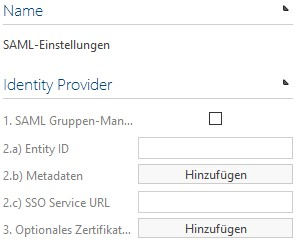
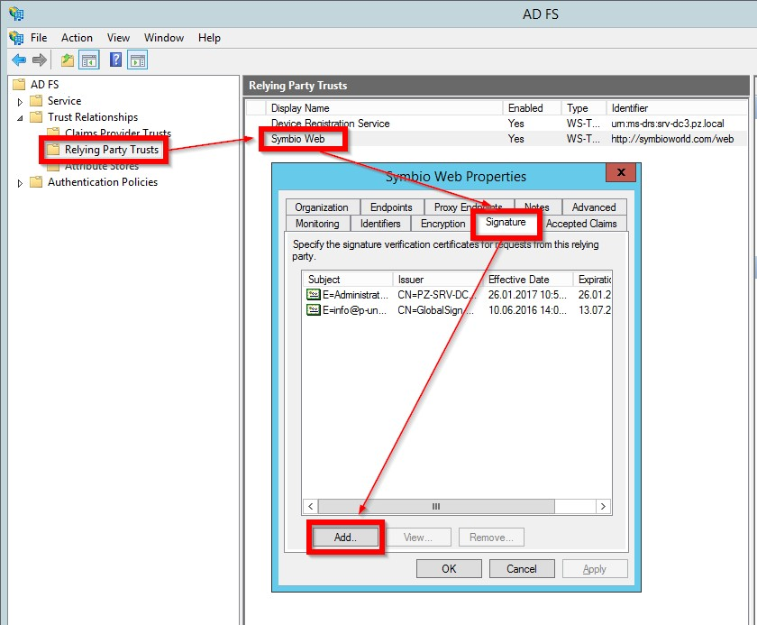

# Signing requests from Symbio to the IdP

## Overview

To make sure an authentication request comes from a trustworthy Service Provider some Identity Provider demand the requests to be signed with a Service Provider certificate.

The Service Provider (here: Symbio) has to have a PFX/P12 archive which combines a private key and its X509 certificate.

The Indentity Provider (e.g. ADFS) has to be informed about the X509 certificate (without the private key, e.g. as CER file).

**As soon as such a PFX file is strored in Symbio in a SAML activated database (or collection) all requests addressed to the configured IdP are signed automatically.**

For the signing the SHA256-Hash algorithm is used.

**The PFX file must not contain a password (or the password can be the empty string &quot;&quot;).**

**Moreover, the PFX file must be stored without encryption in the datbase (or collection).**

## Set-up

 

- &quot;1. SAML group management&quot; has been activated and the respective SAML user groups are created and authorized as well as
- &quot;2.a) Entity ID&quot;, &quot;2.b) Meta data&quot;, &quot;2.c) SSO Service URL&quot; have been configured the
- &quot;3. Optional certificate for request signing&quot; can be uploaded.

All future requests addressed to the IdP will be signed automatically (no matter if necessary or not).

## Creating a certificate (OpenSSL + Windows certification center)

Please adjust the file names PuZ-Dev-Cert.\* according to your requirements.

1. Creating a key and a certification request

    The key for the certificate has to be generated by RSA and should be at least 2048 Bit long.
    OpenSSL ([https://www.openssl.org/](https://www.openssl.org/)) can be used, for example:

    ````cmd
    openssl req -newkey rsa:2048 -subj &quot;/C=DE/ST=NRW/L=Dortmund/O=Ploetz + Zeller GmbH/OU=Dev/CN=PuZ-Dev-Cert/&quot; -nodes -sha256 -keyout PuZ-Dev-Cert.key -out PuZ-Dev-Cert.csr -reqexts v3\_req
    ````

    Please change the subject &quot;/C=DE/ST=NRW/L=Dortmund/O=Ploetz + Zeller GmbH/OU=Dev/CN=PuZ-Dev-Cert/&quot; to fit your company:

    C= Country (2 letters-country code)

    ST= State (federal state/province, can be written in full)

    L= Location (city your company is located in)

    O= Organization (name of your company)

    OU= Organizational Unit (the department/unit in charge of Symbio, e.g. IT, PM or QM)

    CN= Common Name (name of the certificate)

    If you create a password for the \*.KEY file, please memorize it well because you will need it later.

2. Creating the certificate

    Please execute the following command on the Windows server on which your certification instance is managed and follow the instructions of the dialog which appears:

    ````cmd
    certreq -submit -attrib &quot;CertificateTemplate:User&quot;
    ````

    The certificate request file asked for in the dialog is the \*.CSR file created in the previous step. The selected template ensures that the created certificate may be used so sign messages.

    If you are asked for the format of the certificate please do **not** choose Binary. Save the certificate file as \*.CER.

3. Creating the PFX file

    Using OpenSSL you can combine the certificate you have just created and the private key from the first step to a PFX file:

    ````cmd
    openssl pkcs12 -export -in PuZ-Dev-Cert.cer -inkey PuZ-Dev-Cert.key -CSP &quot;Microsoft Enhanced RSA and AES Cryptographic Provider&quot; -out PuZ-Dev-Cert.pfx |
    ````

    Please do not create a password for the \*.PFX file.

4. Using the created files

    Now please store the certificate (\*.CER file) in your SAML Identity Provider as signing certificate of the Service Providers Symbio. This is the respective entry in the ADFS:

    

    Finally, please call up the SAML settings of your Symbio database and upload the \*.PFX file as &quot;3. Optional certificate for request signing&quot;.

    From now on all requests addressed to the IdP will be signed automatically.