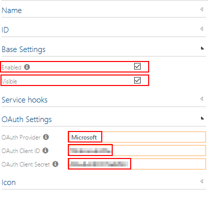

# Symbio SSO

## Setting Up OAuth-based SSO

Symbio supports OAuth 2.0 used with LinkedIn and Microsoft Accounts.

### Setting Up LinkedIn

To register Symbio as an App for your organization goto to "https://www.linkedin.com/developers/apps/new" and
1. Choose an appropriate "App name", e.g. `Symbio OAuth by <Your Organization>`
2. Choose your organization under "Company" (a page admin will have to verify your request)
3. Add an "App logo" of your choice
4. Accept the "Legal terms"
5. Click "Create app"
6. Now select your app, switch to the tab "Auth", and not the following information:
   * Client ID
   * Client Secret
7. Scroll down and specify a valid "Redirect URL", e.g. if your normal Symbio URL was `https://organization.symbioweb.com/Organization/Training/` your "Redirect URL" would be `https://organization.symbioweb.com/signin-linkedin`
8. Save any changes

### Setting Up Microsoft Account

There is a comprehensive guide to setting up your Azure AD tenant: https://docs.microsoft.com/en-us/azure/active-directory/develop/quickstart-register-app

You will need to provide a "Redirect URI". If your normal Symbio URL was `https://organization.symbioweb.com/Organization/Training/` your "Redirect URI" would be `https://organization.symbioweb.com/signin-microsoft`.

*Note your "Application ID" as your "Client ID".*

If successfully registered Symbio as an with your Azure AD tenant, you need to create a Client Secret:

1. Select your new app in Azure Portal
2. Select "Certificates & secrets"
3. Click on "+ New client secret"
4. Choose a name for that secret
5. Choose if/when the secret will expire automatically
6. Click "Add"

*Note the "Value" of the new secret as your "Client Secret".*

### Setting Up Symbio

1. In your Symbio storage switch to "Editor" mode and then into the admin area
2. Scroll down to "Services" and click on "Authentication Providers"
3. In the "Type" dropdown select `OAuth Authentication Provider`
4. Select a name/ID for your new provider and click "New"
5. Select your new provider and enter the information noted above:
   - Client ID
   - Client Secret
6. Ensure you select the correct 3rd party provider, i.e. either `LinkedIn` or `Microsoft`
7. Enable your new provider (and probably also set it to visible)

