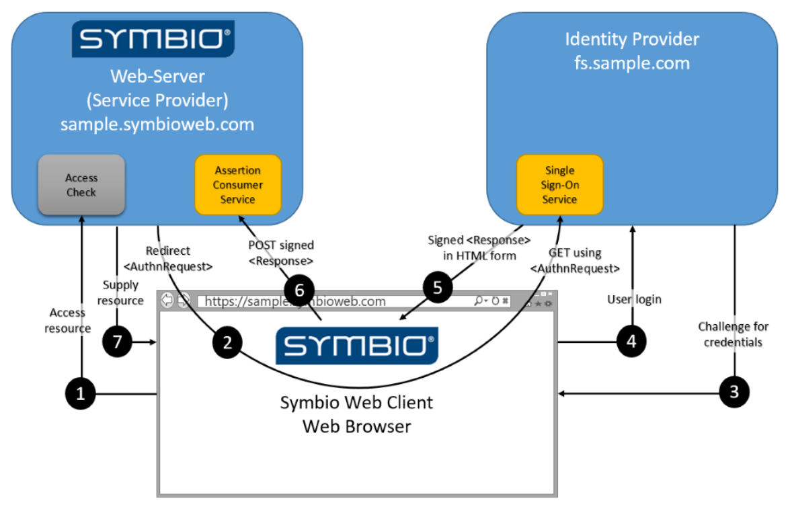

# Symbio SSO

## Introduction

To provide Single-Sign-On capabilities (SSO) Symbio implements the Service Provider part of the SAML protocol.

### What is SAML?

SAML (security assertion markup language, [Wikipedia](https://en.wikipedia.org/wiki/SAML_2.0)) is an HTTP- and XML-based protocol for SSO authentication. It distinguishes two parties which have a mutual trust relation:

* Service Provider (SP) and
* Identity Provider (IdP)

The SP (e.g. Symbio) delegates user authentication to the IdP (e.g. AD FS, Ping Federate) which in turn provides user claims (i.e. user-specific properties like name, e-mail address, group memberships) to the SP. Based on these claims the SP can decide on the authorization level of the authenticated user.

### How does SAML work?

SAML-based authentication is completely browser-based and an interactive process. It can be initiated by the IdP or by the SP. Symbio only supports SP-initiated authentication:

1. The user navigates to the start page of the SP
2. If there is no existing session for the browser the SP redirects the browser to the start page of the IdP (providing additional info about itself to the IdP)
3. If there is no existing login session for the browser the IdP displays a login form to the user
4. Upon successful login (or if there is an existing login session for the browser) the IdP redirects the browser to the start page of the SP (providing the claims of the logged in user to the SP)
5. The SP analyzes the user claims and decides on the authorization level the user will be using for this session

This authentication flow involves two well-known endpoints:

* The SSO Service of the IdP
* The Assertion Consumer Service (ACS) of the SP

### How does Symbio use SAML?

Symbio uses the REDIRECT endpoint of the SSO Service of the IdP to initiate the authentication flow and expects a POST response to its ACS endpoint.

The more detailed flow of events in the context of Symbio authentication/authorization is depicted below:

