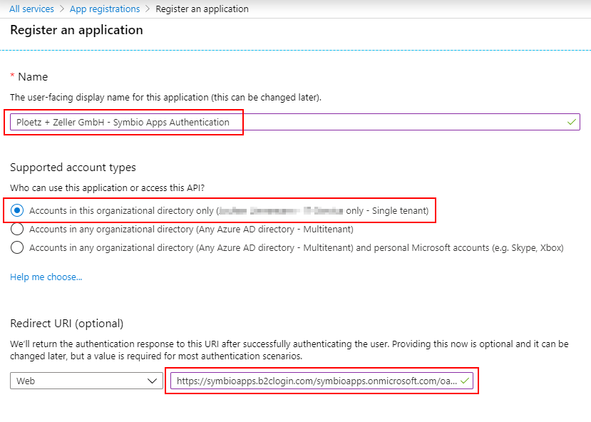

# Configuring Azure AD for use with Symbio Apps

(see [Microsoft Docs](https://docs.microsoft.com/en-us/azure/active-directory-b2c/identity-provider-azure-ad-single-tenant) for further details)

1. In the Azure Portal, follow the path "All Services > App registrations > New registration"
   
   - Choose an appropriate display name, e.g. "Ploetz + Zeller GmbH - Symbio Apps Authentication"
   - Enter the following redirect URL: https://symbioapps.b2clogin.com/symbioapps.onmicrosoft.com/oauth2/authresp
1. Click "Register"
1. Note the Application (aka Client) ID
1. Go to "Certificates & secrets > New client secret"
   - Select a name, e.g. "Ploetz + Zeller GmbH - Symbio Apps Authentication - Secret"
   - Select an expiration
1. Click "Add"
1. Note the Value of the secret
1. Note your Azure AD Tenant Domain
1. Provide the information below to P+Z
1. You are done

## Information you need to provide to P+Z

- Your Azure AD Tenant Domain
- The registered app's Client ID
- The registered app's Client Secret
