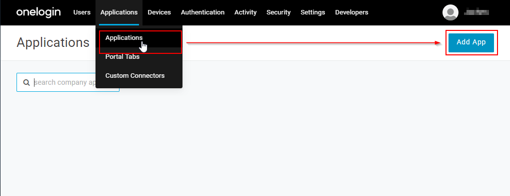
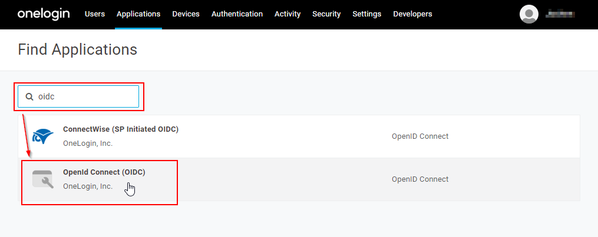
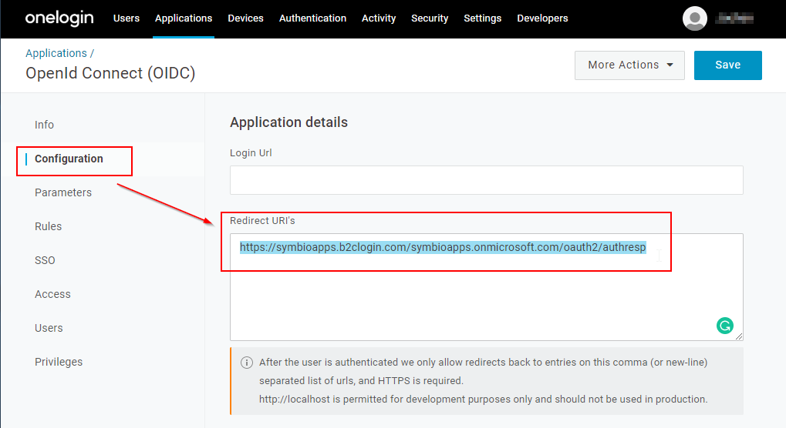
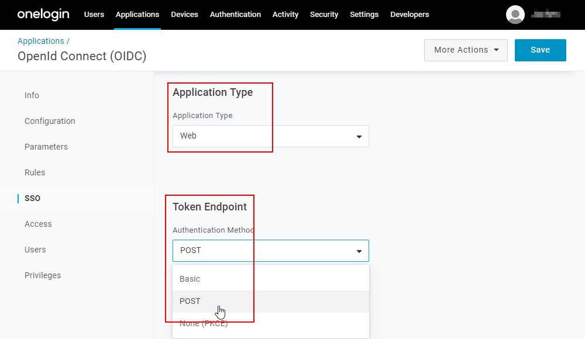

# Configuring OneLogin for use with Symbio Apps

1. In your OneLogin Administration, under "Applications" select "Add App"
   
1. Filter for "oidc" and then select "OpenID Connect (OIDC)"
   
1. Choose an appropriate display name, e.g. "Ploetz + Zeller GmbH - Symbio Apps Authentication"
1. Save your new App
1. Under "Configuration", enter the following redirect URL: https://symbioapps.b2clogin.com/symbioapps.onmicrosoft.com/oauth2/authresp
   
1. Under "SSO", make sure that Application Type "Web" and Token Endpoint "POST" are selected
   
1. On the same page, note the Client ID and the Client Secret
1. Note your OneLogin Domain
1. Save your app again
1. Provide the information below to P+Z
1. You are done

## Information you need to provide to P+Z

- Your OneLogin Domain
- The new app's Client ID
- The new app's Client Secret
