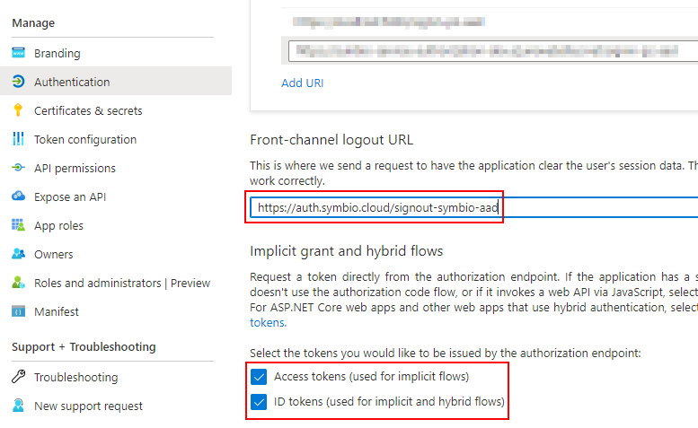

# Configuring Azure AD for use with the Symbio AuthService

Please follow the instructions in [Configuring Azure AD for use with Symbio Apps](../symbio-apps-auth/azure-ad.md) but adjust the _Redirect URI_ as follows:

`https://auth.symbio.cloud/signin-<customer>-aad` 

Example: https://auth.symbio.cloud/signin-symbio-aad

Once registered, adjust the _Front-channel logout URL_ as follows:

`https://auth.symbio.cloud/signout-<customer>-aad` 

Example: https://auth.symbio.cloud/signout-symbio-aad

Enable the issuing of _Access tokens_ and _ID tokens_.

## Claims

The following claims are required and must be sent by the external IdP.

- email (contains the email address of the user)
- given_name (contains the given, e.g. first name of the user)
- family_name (contains the family, e.g. last name of the user)

If the external IdP uses different claim types, make sure to provide a set of claim types (names) that contain the required data. Deviating claim types can then be mapped to the corresponding required claim types in the Symbio AuthService.