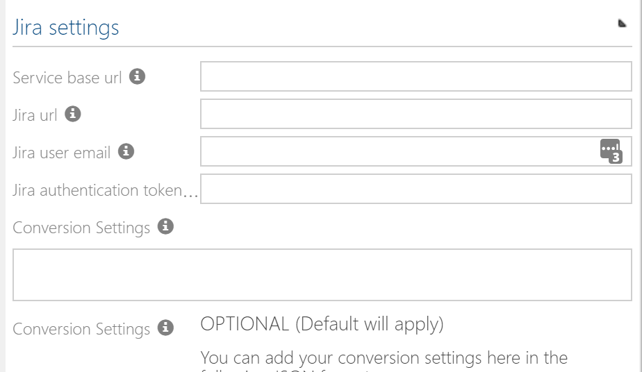

# Symbio to Atlassian micro service configuration

The service is currently made available as a stand alone service on Azure. It uses an Azure repository for the configuration.

## Configuration
### Add the external system type to the Extended configuration on the system administration
1. Log on to the **/_sysadmin/_admin** section of Symbio (Requires System Administration access)
1. Switch to "Editor" mode
1. Go to the Admin area 
1. Go to the "Extended configuration" 
1. Select "New" and add a type for an external system named "Atlassian"
1. Set the following attributes
    1. **Name:** Atlassian
    1. **Description:** Symbio to Jira configuration items required for the integration
1. Select the SYEX file under the data tab with the Title: "external_system_types - atlassianinterface.syex" and click OK. You can use the search / filter bar to shorten the list 
1. Make the external configuration active 
1. Apply changes 

### Add a configured external system linked to the active service
1. Select "External systems" on the main menu bar
1. Add a new external system with "Type" of "Atlassian" 
    1. Name the External System "SymbioToJira"
1. Add the values that is relevant for your Jira instance. Note that the URL values should not end with a "/".
    1. 
    1. (Optional) Add additional configuration to the external system in the settings box in JSON format. Here you can "map" the Symbio stereotypes for your requirements to the equivalent issue types in Jira, as well as the attributes you wish to map between the two systems. Example:

    ```json
        {"ObjectTypes":[
            {   "Active": true,
                "SymbioStereoType": "Epic",
                "JiraIssueType": "Epic",
                "toJira": true,
                "toSymbio": true
            },
            {   "Active": true,
                "SymbioStereoType": "userStory",
                "JiraIssueType": "Story",
                "toJira": true,
                "toSymbio": true
            }],
        "Attributes": [
            {   "Active": true,
                "SymbioAttrType": "name",
                "JiraAttrType": "summary",
                "toJira": true,
                "toSymbio": true
            },
            {   "Active": true,
                "SymbioAttrType": "description",
                "JiraAttrType": "description",
                "toJira": true,
                "toSymbio": true
            }]
        }
    ```

1. The default conversion settings are the following:
Object Types:

| Symbio requirement stereotype | Jira issue type |
|--- |--- |
| Epic | Epic |
| User Story | Story |
| Feature | Epic |
| PBI | Story |

Attributes:
| Symbio attribute 	    | Jira attribute |
|--- |--- |
| Name                  | Summary |
| Description           | Description |
| Custom Jira Status    | status |

   *Please note that the system requires an admin user type on the Jira and Symbio systems for the interface to function correctly*

### Load the external system on the storage
1. Go Home -> Select the Storage Collection or create a new one
1. Go to Admin -> Apply new configuration
1. Select "Storages" on the main menu bar 
1. Choose an existing storage or create a new one
1. Under the external systems group, select the configured external system under the "Atlassian" external systems 

### Result after adding the external system
- Adding the external system to your repository will result in the following
    - All the required attributes will be added to Symbio
    - The webhooks for both systems will be created
    - The selection service for the Jira projects will be loaded

## Remove the external system from the repository

WARNING: You can remove the external system from the repository, but it may have an impact on connected domains. Please disconnect all domains before removing the external system from the repository.

### Remove the external system from the repository

1. Log on to the **/_sysadmin/_admin** area of your Symbio instance
1. Select Storage Collection and select "Storages" to view the list of storages in the Storage Collection
1. Select the storage where the external system is loaded
1. Click on the selected external system and set the drop-down to "Choose" 

### Removal result

- If you remove the external system, the service will remove the Symbio and Jira Webhooks and other configuration items from the respective systems. It will ONLY do so if there are no other configuration that is using the same instances.
- You will no longer be able to connect Symbio to Jira.
