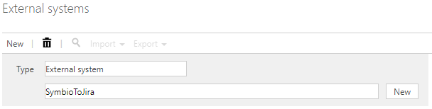

# Symbio to Atlassian micro service configuration

The service is currently made available as a stand alone service on Azure. It uses an Azure repository for the configuration.

## Configuration
### Add the External System to the Symbio Repository
1. Please ask your Ploetz and Zeller representative for the latest SYEX configuration file
1. Log on to the \_sysadmin/_admin section of Symbio (Requires System Administration access)
1. Switch to "Editor" mode
1. Go to the Admin area 
1. Go to the "Extended configuration" area 
1. Select "New" and add a type for an external system named "Atlassian"
1. Set the following attributes
   1. **Name:** Atlassian
   1. **Description:** Symbio to Jira configuration items required for the integration
1. Upload the SYEX file under the settings group with the Title: "Atlassian"  -> 
1. Make the external configuration active 
1. Apply changes 
1. Select "External systems"
1. Add a new external system with "Type" of "Atlassian" 
   1. Name the External System "Symbio2Jira"
1. Add the values that is relevant for your Jira instance
   1.  
   1. *Please note that the system requires an admin type user on the Jira and Symbio systems for the interface to function correctly*

### Load the external system on the storage
1. Go Home -> Select the Storage Collection or create a new one
1. Select "Storages" 
1. Choose an existing storage or create a new one
1. Under the external systems group, select the configured external system under the "Atlassian" external systems 

## Result
- Adding the external system to your repository will result in the following
    - All the required attributes will be added to Symbio
    - The webhooks for both systems will be created
    - The selection service for the Jira projects will be loaded