# Manual configuration steps for Jira
Since version 1.11 of the Symbio to Jira interface, you have the option to disable the configuration of Jira from Micro-service directly.
This is not the preferred method, by default you should select the system to manage the Jira configuration if possible.

To enable the bi-directional updates between Symbio and Jira, both systems use Webhooks to pick up on changes on the requirements / issues and send a request to the micro-service to update the the other system.

On Jira, we have a Webhook for when Issues are created or updated, and another webhook for when an issue is deleted. We also added a link attribute to enable a user to jump to the same requirement in Symbio from the Jira issue.
For more information on the usage of the interface, please have a look at this document: [Using the Symbio service for Atlassian](using_symbioatlassian.md)

Note: The Symbio / Jira connector is an extra paid for service

## Requirements
- You must have Jira system configuration/administration access
- The "Configure Jira?" checkbox must not be selected when adding the external system to the Symbio storage

## Webhooks

### Create/Update Webhook
The Create/Update webhook will send an update request from Jira to Symbio. This webhook will send the Jira requirement to Symbio after it is created or changed  
To configure the Webhook please follow the following steps on Jira

Your view might be different depending on your Jira version. If it is not the same, please check online how to create a webhook for your version
1. Log on to Jira and choose your Jira instance.
1. Select Settings  
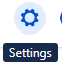
1. Select System  
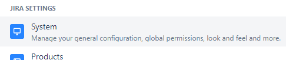
1. Choose Webhooks  
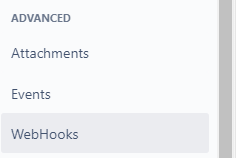
1. Create Webhook  
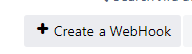
   1. Add Name: "Create / update Symbio"
   1. Add URL: Add the Micro service URL, including the endpoint
      1. Endpoint: /api/service/updatesymbiorequirement
      1. Example: https://microservice-atlassian.net/api/service/updatesymbiorequirement
      3. Note: Please ask you Symbio administrator if you do not know what the Jira service URL is
  1. Select the events for the webhook
     1. Created
     1. Updated  
     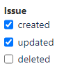
  1. Ensure that the Webhook is Enabled
  1. Create the Webhook  
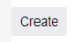

### Delete Webhook
The Delete webhook will send an update request from Jira to Symbio when an issue is deleted in Jira. This changes the state of the requirement in Jira only, and does not delete the requirement.   

To configure the Webhook please follow the following steps on Jira.

Your view might be different depending on your Jira version. If it is not the same, please check online how to create a webhook for your version
1. Log on to Jira and choose your Jira instance.
1. Select Settings  

1. Select System  

1. Choose Webhooks  

1. Create Webhook  

   1. Add Name: "Delete Symbio"
   1. Add URL: Add the Micro service URL, including the endpoint
      1. Endpoint: /api/service/updatesymbiorequirementdelete
      1. Example: https://microservice-atlassian.net/api/service/updatesymbiorequirementdelete
      3. Note: Please ask you Symbio administrator if you do not know what the Jira service URL is
  1. Select the events for the webhook
     1. Deleted
     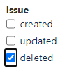
  1. Ensure that the Webhook is Enabled
  1. Create the Webhook  

## Attributes

### Symbio link attribute
When a requirement is linked to an issue in Jira, the link to the issue is added to the requirement, and a link to the Symbio requirement is also added to the issue back to Symbio.

To enable this link, you need to add the link attribute to the issues in Jira.

Add the attribute in the following steps:
1. Select Settings  

1. Select Issue settings  
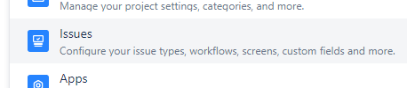
1. Select the Custom fields  
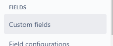
1. Create custom field  

1. Select the URL type and click Next  
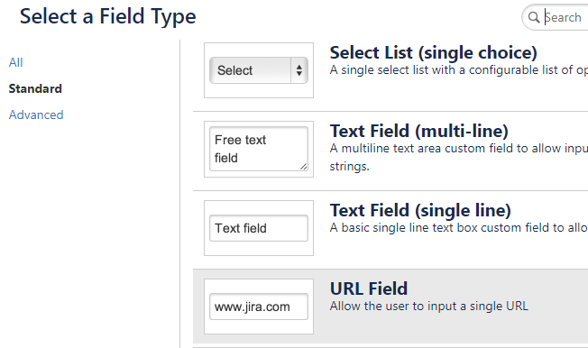
1. Configure the URL
   1. Add this precise name: "Symbio link"
   2. Optionally add a description to describe the Symbio link URL: "Link back to the requirement in Symbio"  
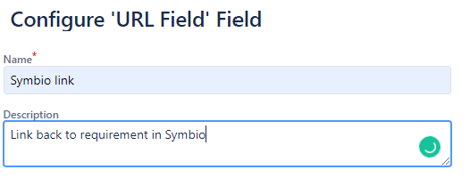
1. Create the field  

1. Select the default screen, unless you only want to add it to specific screens, click "Update" to finalise the creation of the Jira field
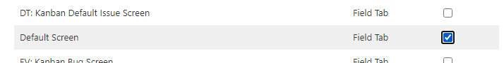