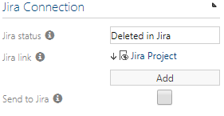

# Using the Symbio to Atlassian

## Prerequisites for the Symbio to Atlassian interface
- The external system for the interface must be loaded on _sysadmin area
- The Jira system details should be added to the configuration
- The configured external system must be loaded on the repository where the system will be used

If all the configuration items listed above is complete, you will be able to complete the steps below to link Symbio to Jira and start using the interface. 
See [Administration guide](administration_guide.md) for more details

## Linking a requirement domain to the Jira project
You must link a domain in the requirements facet to a Jira project for the integration to work. You can also link the Requirement domain to a project on Symbio.

Only connect **one** Jira Project to **one** domain! Connecting the same Jira project to multiple domains will cause unexpected behavior!
1. Go to the Requirements facet and create or select a domain
1. Select the Project from the list under the Jira Connection group on the details panel 

At this point, all of the requirements in the Jira project will be synchronized into the domain. The Symbio requirements will only be sent after the "Send to Jira" check-box have been activated.

## Creating requirements in Symbio and sending the requirement to Jira
1. The recommended way to create requirements is for you to create the requirement under the correct domain linked to the project first. This will ensure that the requirement is synchronized with the correct Jira project.
1. Check the "Send to Jira" check-box to trigger the synchronization of the new requirement to the Jira project. This happens in the background and no further action is required.
1. Activating the "Send to Jira" check-box, will make the requirement read-only. 

*Changes are only allowed on Jira from that point on.*

## Creating Jira Issues and sending them to Symbio
1. Creating an issue (requirement) on Jira will automatically send the requirement to the connected domain in Symbio.

## Updating a requirement on Jira
1. Updating an issue on Jira will automatically update the requirement on Symbio.
 
*Updates are only possible on Jira at this point*

## Deleting a requirement on Jira
1. Deleting a requirement in Jira, will update the requirement in Symbio to reflect the status of "Requirement deleted on Jira".
1. The requirement will be made editable again in Symbio. This will allow you to assess the impact or allow you to make updates on your processes.
1. The requirement will also refer to the project the issue was deleted from.

Requirements will not be deleted in Symbio automatically.

## Moving an issue between projects on Jira
1. When moving a requirement on Jira, the changes will be reflected on Symbio. 
1. Exceptions: When moving an issue to a project that is not connected to Symbio, a new domain will be created in Symbio called "Unknown Jira PRoject" and the requirement will be placed in this domain with it's new Jira ID for reference.
