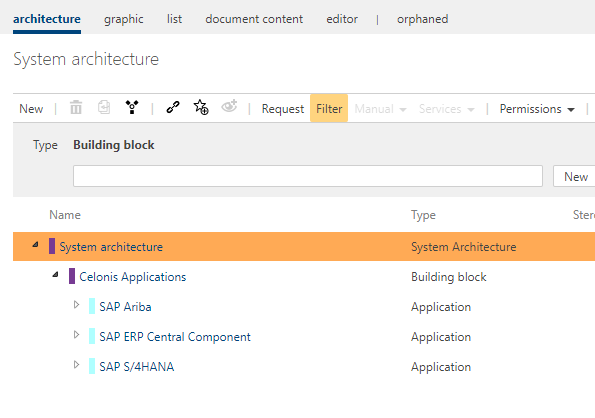
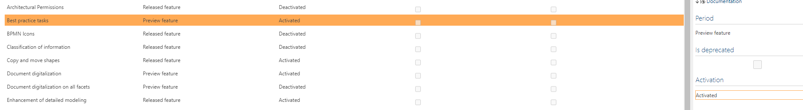
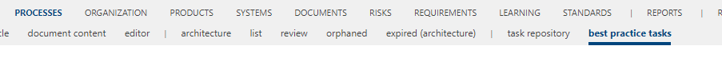
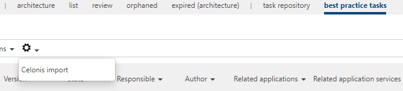
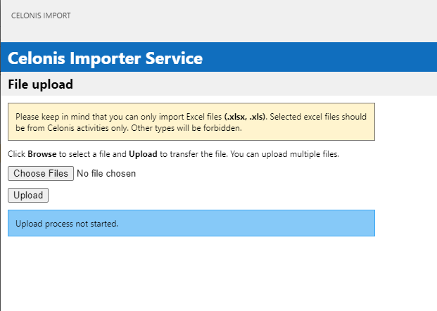
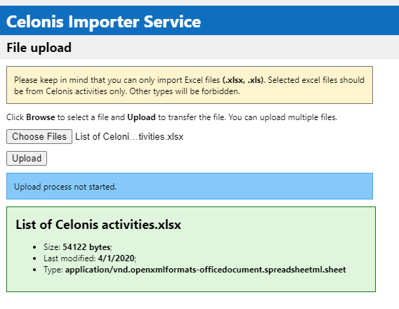
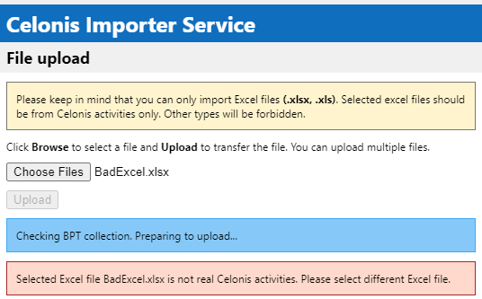
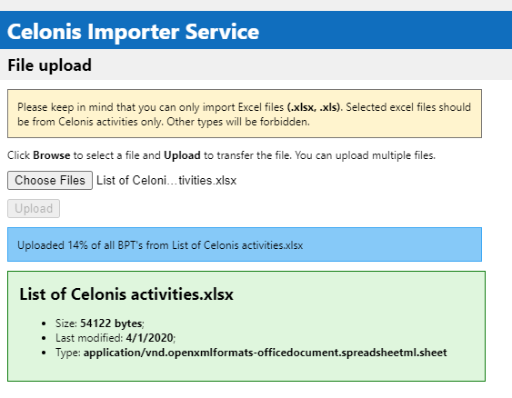
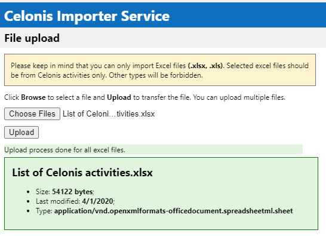
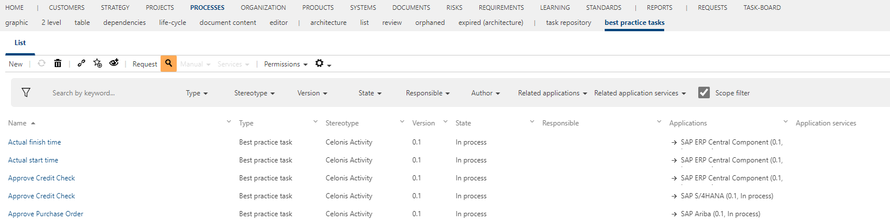

# Using the Celonis Importer

## Prerequisites for the Celonis Importer
- The micro-service must be accessible
- The configured external system must be loaded on the storage where the system will be used
- Symbio needs to be accessible from the service

If all the configuration items listed above is complete, you will be able to complete the steps below to import Celonis activities from excel in Symbio. 
See [Celonis Importer micro service configuration](configuration.md) for more details.

## Checking imported Applications in System facet
With successfully linked Symbio storage with service, in System facet will be added several Application types. By default that will be "SAP Ariba", "SAP ERP Central Component" and "SAP S4HANA" applications. Added applications is customizable and can be changed in configuration. The are added for separation of the best practice tasks as they may happen to be duplicates. 
Every imported best practice task is related with one of the application types.

##  Activation of the "best practice tasks" Feature
1. Before starting to upload Celonis Activities, Best practice tasks Feature must be activated in the Admin area. 
1. After that activation, Best practice tasks facet will be visible in Processes area. 
1. Go to the "best practice task" view of the process facet.
1. Click on Admin button and select "Celonis import" button.  
1. If everything is linked successfully, default dialog window will appear. 
1. On this state, Celonis activities excel file should be chosen for uploading in Symbio.  It's allowed to choose one or more Celonis activities excel files for upload.
1. If chosen excel file isn't Celonis activities, notification error will appear. 
1. If chosen excel file is Celonis activities, process will start and notification line will inform for status. 
1. If process is finished successfully, notification line will show finish status. 
1. When whole process is finished, browser should be refreshed, and all imported best practice tasks will be visible in list view. 
