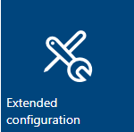
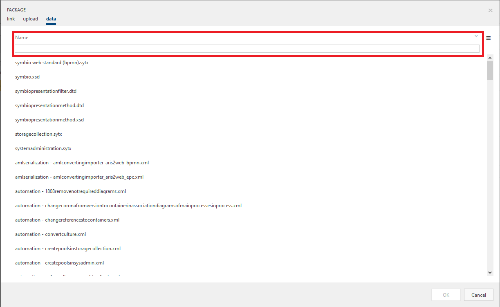
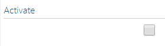
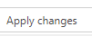
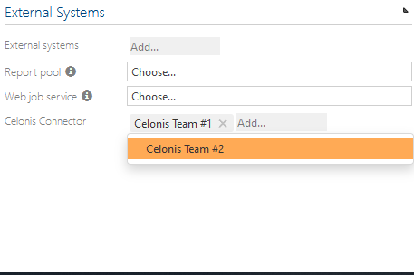
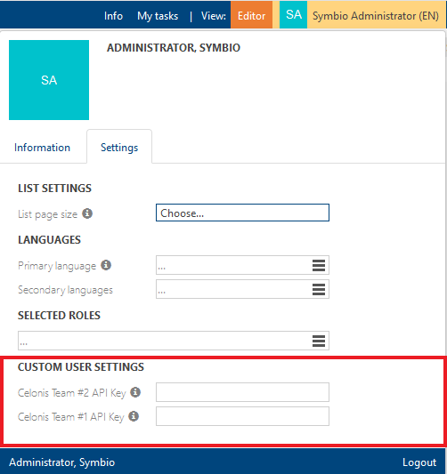
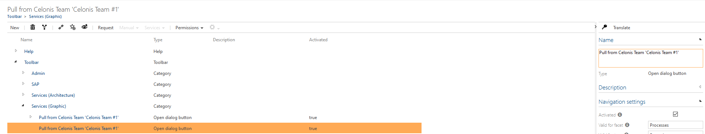

# Celonis Process Mining Connector Configuration

## Configuration
### Add the External System type to the Extended configuration on the system administration

1. Log on to the **/_sysadmin/_admin** section of Symbio (Requires System Administration access)
1. Switch to "Editor" mode
1. Go to the Admin area 
1. Navigate to the "Extended configuration" 
1. Select "New" and add a type for an external system with a preferred name (e.g. Celonis Process Mining Connector)
1. Set the following attributes
   1. **Name:** (Preferred Name, e.g. Celonis Connector)
   1. **Description:** This service is used to export Symbio processes to Celonis and/or vice versa
1. Select the **"Add"**-Button in the "Settings"-Group of the detail content of the service type
   1. A new window should pop up. Select the **"data"**-Tab on the top navigation of the windows
   1. Select the Celonis service data. You can search for it on the top of the window (see screenshot)
   
   1. If you can not find the Celonis service in this list, the Service is probably not shipped with your Symbio version. Please contact your Symbio system administrator in this case.
   1. Note that you can alternatively upload a **.SYEX**-file under the **upload**-Tab on the top of the window
1. Activate the external configuration 
1. Apply changes 

### Add a configured external system linked to the active service
1. Select "External systems" on the main navigation bar
1. Add a new external system with Type of **"Celonis Connector"**
   1. Enter a name for the service. It is recommended to name the service like the Team you want to connect in this entry (e.g. Celonis Team 1)
1. Add the URL data for the instance of the micro-service 
   1. **Service URL:** Enter the URL of the service. It should look similar to the URL you see in the in the screenshot
   2. **Service UI URL:** Ener the URL of the UI which the service uses. It should also look similar to the URL you see in the screenshot
   3. **Celonis Team URL:** Enter the URL of your Celonis Team here. The pattern of the URL should be similar to the one given in the screenshot

### Connect the external system on the storage
*Note: multiple storages can be connected to one instance of the service*
1. Select "Home" on the main navigation bar
1. Select a Storage Collection or create a new one
1. Select "Storages" on the main navigation menu
1. Choose an existing storage or create a new one
1. Under the external systems group, select the configured external system under the "Celonis Synchronization Service" drop down items 
1. Note that you can connect multiple Celonis Teams to the Storage if you want to

### Setting an API Key
1. Select "Home" on the main navigation bar
1. Navigate to the storage you activated the Celonis Process Mining Connector for
1. Open the user flyout in the upper right corner of your view
1. In the flyout select the Tab "Settings"
1. On the bottom of the flyout, enter a valid Celonis API Key in the given field for you services (Highlighted area on the screenshot below). For further information on how to generate a Celonis API Key, please visit https://(YourCelonisTeamDomain)/help/display/CIBC/User+Profile

### Result after adding the external system
- Adding the external system to your repository will result in the following
    - All the required configuration will be added to Symbio
        - Possibility to add an API Key in the user flyout
        - Possibility to add an API Key in the "User" facet in the admin area
        - Two new service buttons for each added Celonis Team to push and/or pull processes from Symbio to Celonis and vice versa
        - New entries in the navigation facet of the admin area

### Optional / additional configuration
If you want, you can customize the new created buttons for you team(s) regarding the lettering. Proceed as follows:
1. Navigate into the admin area
1. Select the **"Navigation"**-Facet
1. Extend the **"Toolbar"** list entry
1. Extend the **Services (Graphic)** list entry
1. You should now see a list of items with the type **"Open dialog button"**. Select the button you want to edit
1. You can now edit the label the button is displaying and / or translate the the label into a different language (see screenshot)

