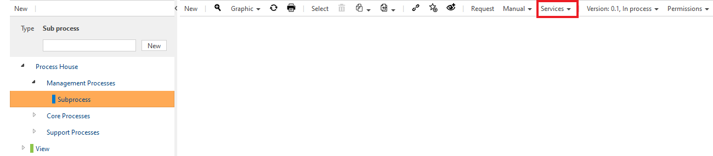

# Using the pull function of the Celonis Process Mining Connector

## Prerequisites for the Celonis Process Mining Connector
- The micro-service must be accessible
- The configured external system must be loaded on the storage where the system will be used
- A valid Celonis API Key should have been set

With all the prerequisites above, you should now be able to pull processes from Celonis into Symbio or update them if they already exist. See the steps below to learn how.

## Open the service
1. Login to Symbio
1. Navigate into the Storage Collection and the Storage for which you activated the service
1. Select the "Processes" menu item on the main navigation bar
1. Select or create a subprocess / a scenario
1. Open the "Services"-dialog in the toolbar 
1. Click on "Pull from Celonis Team 'Celonis Process Mining Connector'"

## Usage of the pull function
1. If the dialog is loaded successfully, you should now see a view in your browser similar to this:

1. You can now select the processes you want to transfer into Symbio. Proceed as follows:
    1. Select the Celonis Categorie the processes are stored in (**Marking 1** on the Screenshot)
    2. Depending on that, the contained processes will be loaded in the "Celonis Processes" selection field (**Marking 2** on the Screenhot)
        - Please note that it is possible to select multiple processes from the **same category** simultaniously
    3. If you have selected the processes you wish to import, click on the "Pull selected Processes" button below (**Marking 3** on the Screenshot)
    4. The service will now start to import the processes from Celonis into Symbio
    5. When the import is finished, you will get a green notification on th upper right side of the dialog
1. After closing the dialog, you can find the imported processes in the selected subprocess or scenario 