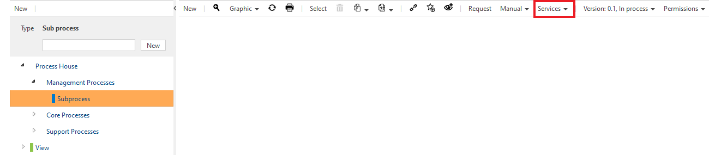
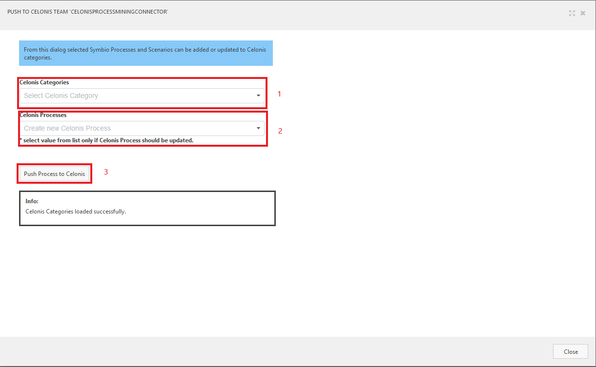
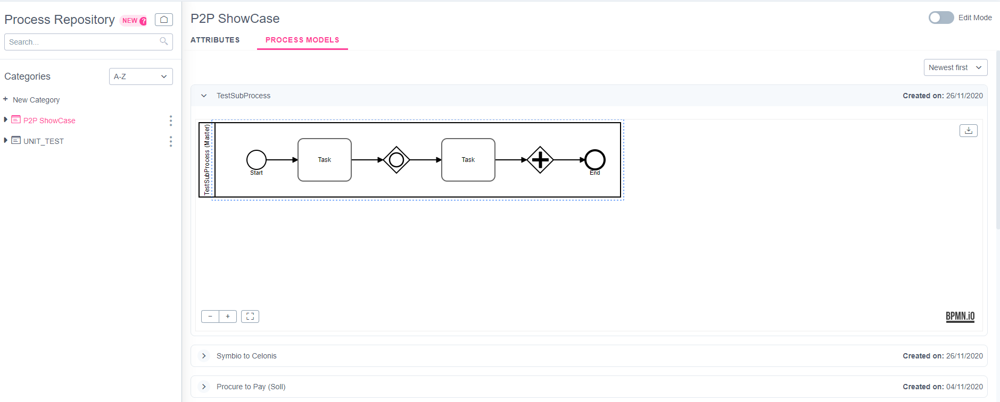

# Using the pull function of the Celonis Process Mining Connector

## Prerequisites for the Celonis Process Mining Connector
- The micro-service must be accessible
- The configured external system must be loaded on the storage where the system will be used
- A valid Celonis API Key should have been set

With all the prerequisites above, you should now be able to push processes from Symbio to Celonis or update them if they already exist. See the steps below to learn how.

## Open the service
1. Login to Symbio
1. Navigate into the Storage Collection and the Storage for which you activated the service
1. Select the "Processes" menu item on the main navigation bar
1. Select or create a Subprocess you wish to export to Celonis
1. Open the "Services"-dialog in the toolbar 
1. Click on "Push to Celonis Team 'Celonis Process Mining Connector'"

## Usage of the push function
1. If the dialog is loaded successfully, you should now see a view in your browser similar to this:

1. You can now select the processes you want to transfer into Celonis. Proceed as follows:
    1. Select the Celonis Categorie you want to push your process to (**Marking 1** on the Screenshot)
    2. Depending on that, the contained processes will be loaded in the "Celonis Processes" selection field (**Marking 2** on the Screenhot)
        - Please note that this is an optional field. You only need to select a process here if you want to **update** a process on Celonis side
    3. If you have selected all necessary fields, click on the "Push Processes to Celonis" button below (**Marking 3** on the Screenshot)
    4. The service will now start to export the processes from Symbio to Celonis
    5. When the export is finished, you will get a green notification on th upper right side of the dialog
1. After the export succeeded, you should find the process in your Celonis Team as you can see below:

