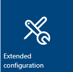

# Celonis Synchronization Service Configuration

## Configuration
### Add the External System type to the Extended configuration on the system administration

1. Log on to the **/_sysadmin/_admin** section of Symbio (Requires System Administration access)
1. Switch to "Editor" mode
1. Go to the Admin area 
1. Go to the "Extended configuration" 
1. Select "New" and add a type for an external system with a preferred name (e.g. Celonis Synchronization Service)
1. Set the following attributes
   1. **Name:** (Preferred Name, e.g. Celonis Synchonization Service)
   1. **Description:** This service is used to export Symbio processes to Celonis and/or vice versa
1. Upload the SYEX file under the settings "upload" group with the Title: "Celonis"
1. Make the external configuration active 
1. Apply changes 

### Add a configured external system linked to the active service
1. Select "External systems" on the main navigation bar
1. Add a new external system with Type of "CelonisSynchronizationService" 
   1. Name the External System "Celonis Synchronization Service"
1. Add the URL for the instance of the micro-service 

### Connect the external system on the storage
*Note: multiple storages can be connected to one instance of the service*
1. Select "Home" on the main navigation bar
1. Select a Storage Collection or create a new one
1. Select "Storages" on the main navigation menu
1. Choose an existing storage or create a new one
1. Under the external systems group, select the configured external system under the "Celonis Synchronization Service" drop down items 

### Setting an API Key
1. Select "Home" on the main navigation bar
1. Select the storage you activated the Celonis Synchronization Service for
1. Select the user flyout in the upper right corner of your view
1. In the flyout select the Tab "Settings"
1. On the bottom of the flyout, enter a valid Celonis API Key. For further information how to generate a Celonis API Key, please visit https://(YourCelonisTeamDomain)/help/display/CIBC/User+Profile

### Result after adding the external system
- Adding the external system to your repository will result in the following
    - All the required configuration will be added to Symbio
        - Possibility to add an API Key in the user flyout
        - Possibility to add an API Key in the "User" facet in the admin area
        - Two new services for pushing and/or pulling processes from Symbio to Celonis and vice versa
    - The service connection and the required Authentication token will be stored on the Azure storage
