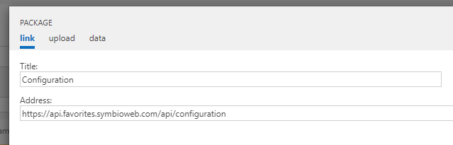
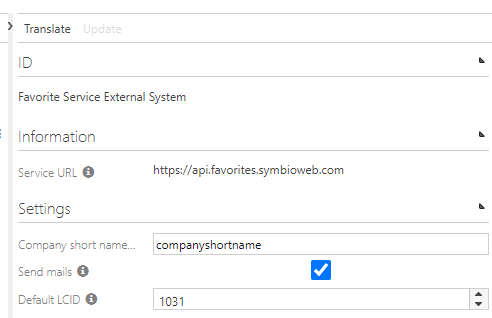

# Favorite Service Configuration

## Create the external system type

1. Go to the **_sysadmin** page's "Extended Configuration"
2. Create a new external system type for the Favorite Service 
3. **The syex file is now provided by the service via this url**: https://api.favorites.symbioweb.com/api/configuration 
4. Enter the configuration url in the settings menu and press OK: 

5. Activate the external system type
6. Apply the configuration 

## Create and configure the external system

1. Using your external system **type**, create a new **external system**
2. Check the automatically entered service url for correctness 
3. The following settings can be configured:
   1. **Company short name**: The short name of your company (it's also used within the authentication service for example) 
   2. **Send mail**: Only send emails when set to **true**. Users who have a favorite group that contains a newly released Symbio element will then be notified via email.
   3. **Default LCID**: The default lcid of the Favorite Services language. It determines the **language of the emails** and the initial language of the services UI when first opened via Symbio.

## Connecting the system to a storage

1. Apply the new configuration on the database collection if not already done
2. Select the storage and choose your external system in the dropdown

**Note**: Connecting the system to the storage transmits the current favorites of each user to the service. **This can take more than one hour** depending on the amount of users and favorites in the storage.

# Maintain the authentication token validity 

The service uses a Symbio **authentication token** to communicate with the storage. It's initial validity ends after one year and needs to be regularly maintained.

1. Maintain the authentication token validity date within the connected storage's automation facet. 
2. Token name: **Favorite-Service-Token-EXTERNAL_SYSTEM_ID** 
