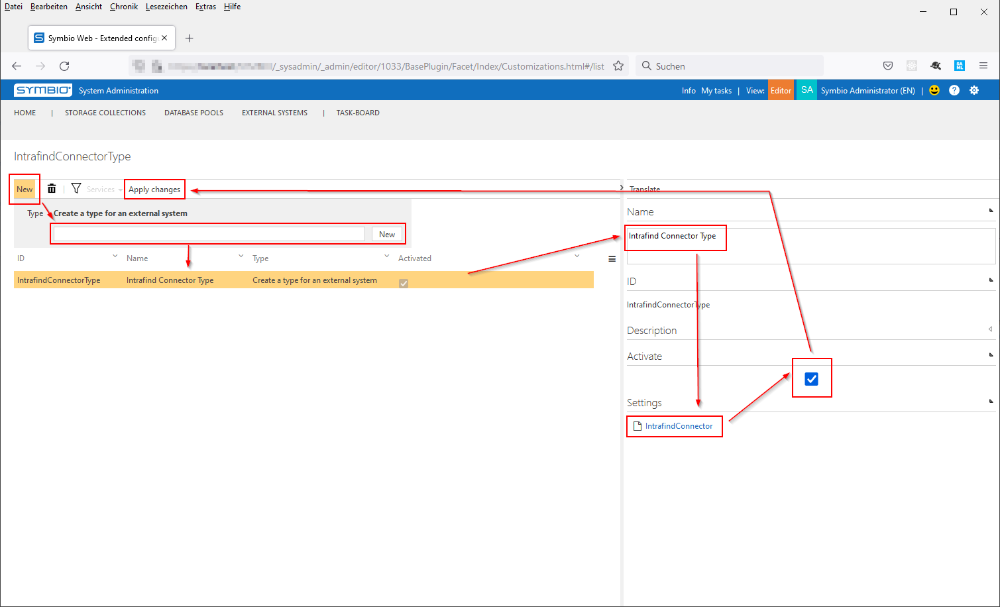

# Configuration

## Requirements

Symbio-Version: Release-Build December 2021 or newer

## Configuring Symbio

The following steps describe how to set up the usage of the Intrafind Connector in Symbio.
This will usually be done by Symbioworld who manages your Symbio instance.

### Setting up a new External System

1. In Symbio, enter the admin page of the System Administration and select Configure > Extended configuration.
1. Create a type for an external system, e.g. "IntrafindConnectorType":
   - Name the new type appropriately;
   - Add the settings file "external_system_types - intrafindconnector.syex" from Symbio's Data tab in the "Package" dialog;
   - Activate the new type;
   - Press "Apply changes".
   
1. In Symbio, enter the External Systems facet of the System Administration and create a new external system:
   - Choose your new type from the drop down and enter an appropriate ID, e.g. "Intrafind Connector";
   - Set the Symbio Intrafind Connector URL to the web service URL generated during installation;
   - Set the Token to access the connector to the value defined during installation;
   - Choose at least the User Role "Author Access";
   - Set the URLs for following Intrafind services:
     - Intrafind Index, e.g. "https://ifinder.example.symbioweb.com:9605/";
     - Intrafind Search, e.g. "https://ifinder.example.symbioweb.com:9605/";
     - Intrafind Converter, e.g. "https://ifinder.example.symbioweb.com:9602/";
     - Ensure all these Intrafind services are up and running.
   - Always fill Intrafind 'Tenant' field with the word "public", until otherwise advised by Symbioworld support!
      - This tenant is not related to Symbio's tenant.
   - Set the Element Type Filter to the API names of the elements which should be indexed by II, e.g. "[ "mainProcess", "subProcess" ]"
   - Set the Attribute Type Filter to the API names of the attributes which should be indexed by II, e.g. "[ "name", "description", "links" ]"
   
1. Add the new external system to all storages that should be searchable via Intrafind.
   - For existing storages, you may need to execute "Apply new configuration" on the admin page to activate new settings.

### Conclusion

The connected storages will from now on send their filtered content to Intrafind for indexing.
As a Viewer in Symbio you will be able to search for configured released elements using the Intrafind index.
