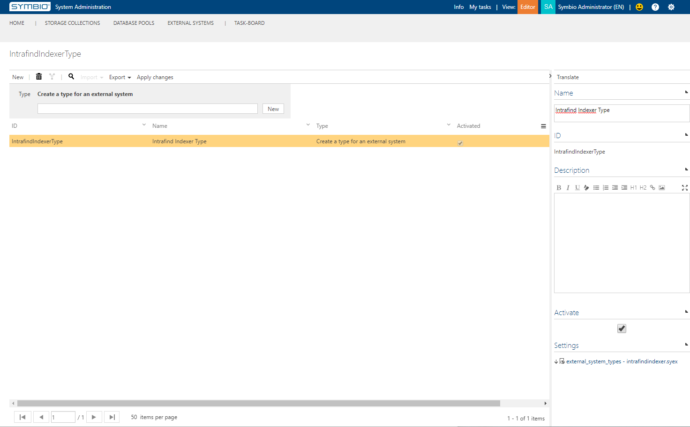
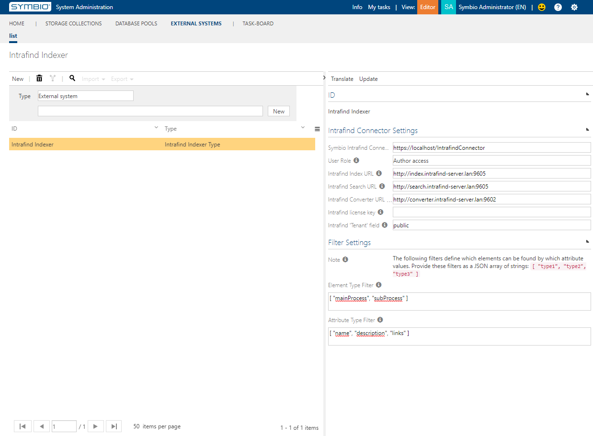

# Configuration

## Requirements

Symbio-Version: Release-Build 20th January 2020 or newer

## Configuring Symbio

The following steps describe how to set up the usage of the Intrafind Indexer (II) in Symbio.

### Setting up a new External System

1. In Symbio, enter the admin page of the System Administration and select Configure > Extended configuration.
1. Create a type for an external system, e.g. "IntrafindIndexerType":
   - Name the new type appropriately;
   - Add the settings file "external_system_types - intrafindindexer.syex" from Symbio's Data tab in the "Package" dialog;
   - Activate the new type;
   - Press "Apply changes".
   
1. In Symbio, enter the External Systems facet of the System Administration and create a new external system:
   - Choose your new type from the drop down and enter an appropriate ID, e.g. "Intrafind Indexer";
   - Set the Symbio Indexer URL to the chosen IIS binding of your II installation;
   - Choose at least the User Role "Author Access";
   - Set the URLs for following Intrafind services:
     - Intrafind index service, e.g. "http://index.intrafind-server.lan:9605";
     - Intrafind search service, e.g. "http://search.intrafind-server.lan:9605";
     - Intrafind converter service, e.g. "http://converter.intrafind-server.lan:9602".
     - Ensure all these Intrafind services are up and running.
   - Keep the license key field empty, until otherwise advised by P+Z support!
   - Always fill "Intrafind 'Tenant'" field with the word "public", until otherwise advised by Intrafind or P+Z support!
      - This tenant is not related to Symbio's tenant.
   - Set the Element Type Filter to the API names of the elements which should be indexed by II, e.g. "[ "mainProcess", "subProcess" ]"
   - Set the Attribute Type Filter to the API names of the attributes which should be indexed by II, e.g. "[ "name", "description", "links" ]"
   
1. Add the new external system to all storages that should be searchable via Intrafind.
   - For existing storages, you may need to execute "Apply new configuration" in admin page to activate new settings.

### Conclusion

The connected storages will from now on send their filtered content to Intrafind for indexing. To be able to find something from within Symbio using Intrafind you will need to also set up the Intrafind SearchProxy and connect it to those storages, too.
