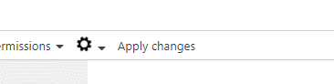
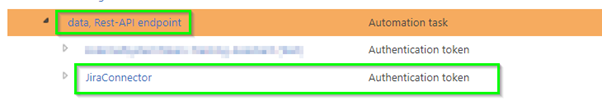
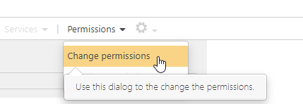

# Installation Preparation (Symbio)

## Create Custom Attributes

Create the following custom attributes which are necessary for the Jira Connector:

Administration --> Extended Configuration

**Jira Project Key**

Attribute | Value
---| ---
ID | JiraProjectKey (ID must match exactly)
Name  | e.g., “Jira Project Key” (Singleline text attribute)
Valid for types | Requirements -> Domain
Group |	Administrative attributes 
Available in REST API | true
Language independent | true

**Jira Status**

Attribute | Value
---| ---
ID | JiraStatus (ID must match exactly)
Name | E.g., “Jira Status” (Singleline text attribute)
Valid for types | Requirements -> Requirement
Group | Detail
Available in REST API | true
Language independent | true

**Click "Apply changes"**

## Create a token

Create a authentication Token to establish the communication between Symbio and Atlassian Jira

Administration --> Automation

Create new Authentication token bellow "data, Rest-API endpoint"

Change permissions to "Administrator"

Change the "End of Validity" date to user defined date

The end date should be noted and extended early.

Copy the token it will be used in the Jira configuration
