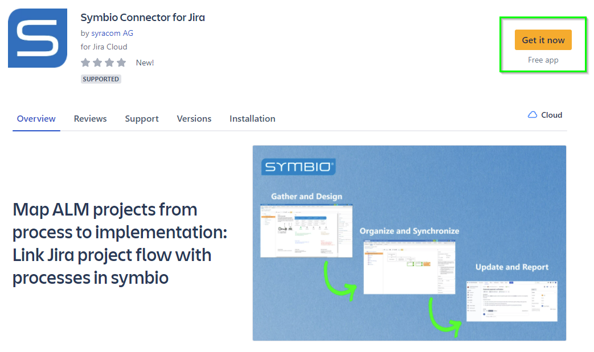

# Installation Symbio Connector (Jira)

## Install Symbio Connector

1. Log into your Jira instance.
2. Click the **Apps** dropdown and choose **Find new apps**.

    The Find new apps screen loads.

3. Search for **Symbio Connector for Jira** and click on the app tile.

    The App Details screen loads.

4. Click **Get app** to start installing your app.

5. You're all set!
    
    Click **Close** in the Installed and ready to go dialog.

Here the direct [Download Link](https://marketplace.atlassian.com/apps/1227811/symbio-connector-for-jira?hosting=cloud&tab=overview) to the Symbio Connector for Jira.

