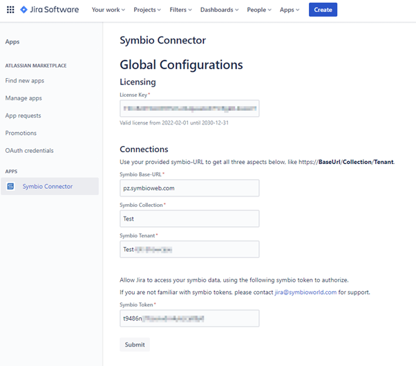
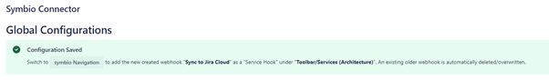

# Configuration Symbio Connector (Jira)

## Licensing
You can start with a free trial license after the trial period you can contact jira@symbioworld.com for a full license.

## Connection
Enter the following attributes and enter **Submit** 
- Symbio Base-Url
- Symbio Collection
- Symbio Tenant (Storage)
- Symbio Token (You created this in the previous step.)
 

 

## Configuration
 

Continue the [Configuration](4-configuraiton-symbio-connector.md) in Symbio.
