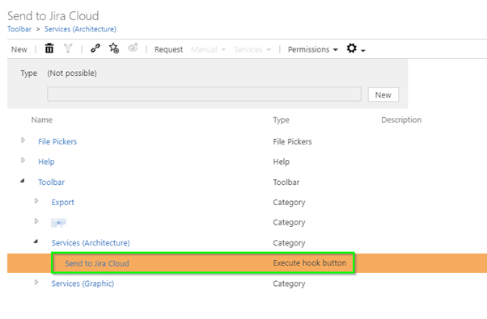
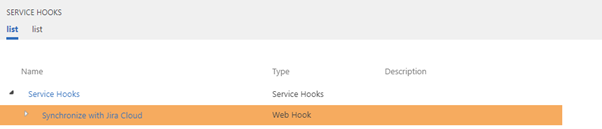

# Configuration Symbio Connector
## Configure Send to Jira Button
Administration --> Navigation --> Toolbar

 

Add an “Execute hook button” with a name like “Send to Jira Cloud”

**Navigation settings:**

Attribute | Value
---| ---
Activated | true
Valid for facet	| Requirements
Valid for type	| Requirement
Service Hooks | Synchronize with Jira Cloud (See Screenshot)

 
